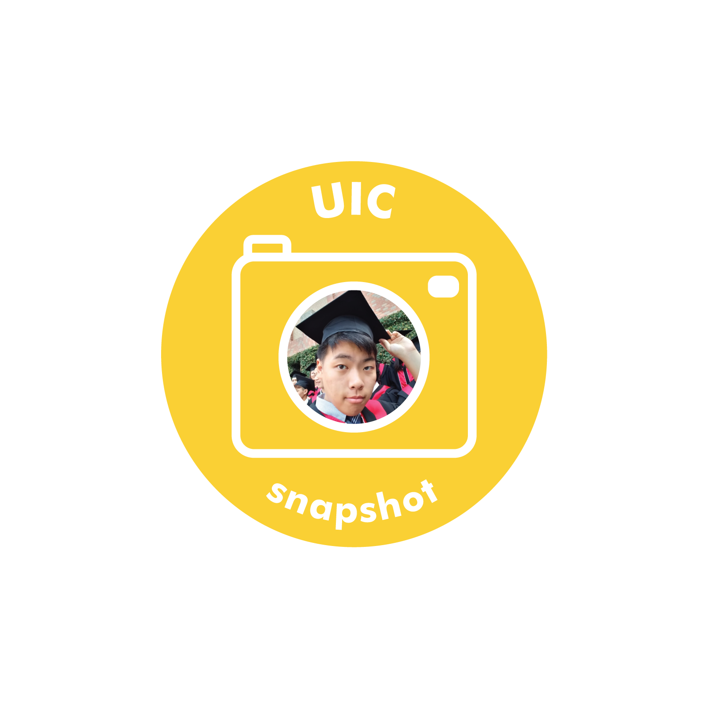

Interview with Yosub Lim, who started in the fall of 2020. Major undecided.

**What is your typical day in college?**

Alarm, classes, lunch, classes, dinner, assignments/procrastination, sleep.

**What’s a hobby that you love? How did you fall in love with it?**

I like to play video games. I started playing video games because my friends were playing them. Nowadays, even when my friends are not playing, I still enjoy it when I have some time off.

**Why did you decide to come to South Korea to attend Yonsei University?**

As a Korean, I wanted to study in South Korea, and I was honored to get accepted into one of the SKY universities, Yonsei University. I chose Yonsei mostly because it was founded by a Christian missionary, and its motto is the same as my high school’s motto. I hope to meet a lot of friends at Yonsei University and expand upon the chapters of my life.