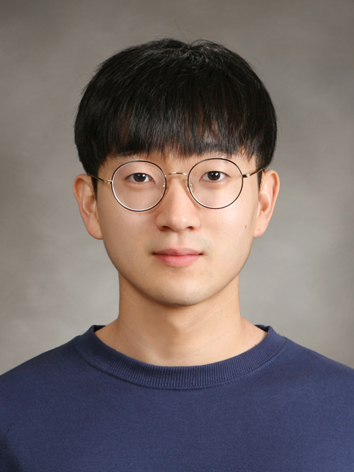

<!--StartFragment-->

Interview with Younghyun Kim, class of 15, majoring in Culture and Design Management.

**How are you doing in the COVID-19 era? What do you do to spend time at home?**

Other than not being able to meet friends as much as before, not a lot has changed. I mostly spend my free time reading fiction or watching movies.

**As a senior, what are your plans after graduation?**

I am currently working as a content designer at a local IT company. This is my last semester as a student, and I will probably continue working after I graduate.

**What was the most memorable experience in UIC that helped you to decide your career?**

Personally, the best experiences in UIC have been outside the classroom. I am not trying to say that classes are unimportant, you can definitely learn a lot from UIC’s skilled professors. However, if there is a specific field of study you want to pursue, I recommend gathering other students with similar interests and taking part in various activities. These experiences can help you prepare for life after school, and more importantly you can make some great friends!

<!--EndFragment-->