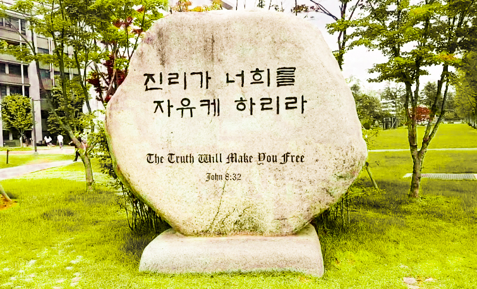

In first year, most students realize with disappointment that a course they were eagerly looking to take ends up overlapping with Chapel. They’re busy people, and at the very least, would rather spend that precious time working on assignments or catching up on sleep. Perhaps some students have missed exactly two times but forgot to turn in one of their weekly reflections and are admittedly retaking Chapel. The burning question at the back of their heads is, why is it mandatory? The unsatisfying, common answer, of course, is that in 1885, the school was founded by two fervent Christian missionaries, Horace N. Allen and Horace G. Underwood. How is this related to Yonsei’s student body?

This fall semester’s Chapel welcomed students by revisiting Yonsei University’s mission statement founded on the Bible verse of John 8: 31-32: “If you hold to my teaching, you are really my disciples; then you will know the truth, and the truth will set you free.” The Dean of Chaplaincy Reverend Dae Sung Lee remarked that human beings are born with an innate craving for freedom, an essential component to our happiness. To attain such freedom, one must be equipped with an understanding of the truth, lest we build our lives on shaky sources that will fail to satisfy us. In recent age, rapid technological advancements seem to be successfully bridging the gap between the unknown and what can be known, bringing mankind closer to the absolute truth. This can be seen in space studies, archaeological discoveries, breakthroughs in AI and biometrics, among others. We can study the intricacies that make up the living down to the microscopic level of a cell. It’s hard not to marvel at it all.

In the face of all this so-called progress, however, an observant eye questions, is this really the path taking us to freedom? Is history not but a succession of wreckage upon wreckage, unexplainable by pure rationality? We cannot turn a blind eye to the countless wars and the social injustices raising the toll of deaths every day. Reverend Lee quotes from Yuval Harari’s “Homo Deus: A Brief History of Tomorrow”:

> “Despite the astonishing things that humans are capable of doing, we remain unsure of our goals, and we seem to be as discontent as ever… Self-made gods with only the laws of physics to keep us company, we are accountable to no one. We are consequently wreaking havoc on our fellow animals and the surrounding ecosystem, seeking little more than our own comfort and amusement, yet never finding satisfaction.”

Essentially, Harari tries to convey an ironic cycle of human pursuit – that the more people idolize themselves in the attempts to gain freedom, the further they drift away from it. In his book “Counterfeit Gods,” theologian Timothy Keller writes that humans idolize anything and everything, from economic prosperity, authority, and accomplishments, to romantic love, peer approval, ideologies, and more. While these things are not inherently wrong, making gods out of them cannot give everlasting joy. Being enslaved by self-absorbed desires evidently results in a generation of people plagued by a host of mentally and physically manifested health issues, such as regular burnouts, anxiety, and depression.

These are not individual, isolated cases, but a warning symptom in society at large. Both authors ponder: Why do we run so meaninglessly hard, only to discover more suffering at the end of the race? Why are we met with an ever-increasing sense of existentialism and ubiquitous emptiness the more we achieve? One purpose of Chapel is to provide students with the opportunity of a much needed rest from the constant grind of life. It grants them a space to contemplate where they should be placing their faith to find true fulfillment as emotional and spiritual beings.

In the biblical context of Chapel, one can interpret that God created mankind to have free will and reason, i.e., the gift of choice. Consequently, people were given a choice to sin, to disregard the conscience and laws of morality. However, the truth on which humans collectively stand is that the price of sin is suffering and despair. It is to this phenomenon that the Bible responds with a message of hope. God so loved the fallen human race that he promised a Savior, his Son Jesus, to pay for the ransom of their sins so that they would no longer live in fear and shame. Jesus says, “I am the way and the truth and the life” (John 14:6). He was crucified in their place, epitomizing the unconditional love of God towards humanity. He also overcame death in his resurrection, promising to give eternal life to those who hold steadfast to his teaching. Conclusively, Christian morale intends to show that God gives guidance towards freedom from the weight of human flaws through forgiveness and love. To have a Yonseian spirit is to embody the value of service towards the community, caring for our neighbor as ourselves. May students of this university continue to meditate on the truth and be set free from the restrictions of the mundane.