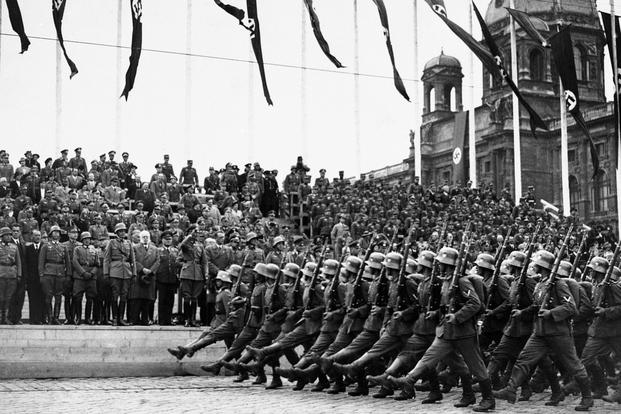

“Arise Corona microbes,

close ranks,

We are ready for combat.

With our viral proteins we consecrate this flag,

a symbol of a new era.

On its red and white background,

Shines our crown-shaped spikes.

Parading in their seamless goose steps, soldiers of the Corona party were celebrating their win with their victory anthem. These creatures, with their protein-coated skin and RNA silhouette, flooded through every corner of the streets. The virus troopers wanted to show off their sense of invincibility. The pedestrians gathered on the street - or what they called Vein Road - and stared with trembling eyes. They attempted to assure themselves that everything was going to be fine, but their nucleus could not lie. The children were too innocent to realize why their parents were tightening their grip on them.

“Halt!”

At that exact moment, the army stopped dead in its tracks. The virus at the forefront wore a badge that had been engraved with a crown. The leader of the battalion dramatically saluted his soldiers, extending its translucent right arm from its neck into the air, straightening it.

“Hail Corona!”

The soldiers replied in unison with a thundering roar.

“Hail Corona!”

The cheers of the soldiers blasted through the town of Trachea, a small temporary settlement located at the windpipe adjacent to the lungs. Some townsfolk clumsily tried to blend in with the hurrah, but most of the microbes remained hesitant.

“My brave soldiers, we have finally reached the entrance to the lungs. You have not disappointed me. My confidence in all of you knows no bounds. The battle beginning today will decide the fate of the Corona nation for the next thousand years!”

The general’s expression grew more and more fanatic with every word. His ambition and drive were infectious.

“Smashing the white blood cells will leave the immune system shattered. Corona will then take over the lungs and the rest of the body. This is a war of extermination. For Virus is the master race and it is our mission to preserve the purity of our kind through infection.”

All of the civilian microbes, even those who dared to join the toast, felt their cytoplasm turn cold at the possibility of the Corona army dominating the world. The general, who seemed to enjoy the microbes’ terrified looks, gave a wicked leer.

It stretched out his semi-transparent hand with its thumb pointed upwards. Then he slowly plunged the tip down.

“Hail Corona!”

What would the scenario be if the coronavirus microbes had human characteristics? The organisms would act and think no different than humans – They would form societies, socialize with one another, create a social/bodily hierarchy and even initiate wars with each other. The human body would be their universe, just like the one we experience, but on a microscopic level. If the coronavirus 19 pandemic was indeed a war of the microbe universe, it would resemble the brutal holocaust committed by the Nazi party.

Samuel Langhorne Clemens, who is known to more by his pen name Mark Twain, introduced this concept by exploring a vast world under a microscope in his work Three Thousand Years among the Microbes. This journey to a nanoworld follows a narrator, called Huck, who transforms into a microbe. The twist is that while he takes the form of a microbe, his human consciousness continues to exist. He thus depicts a world in which microorganisms exhibit human qualities and emotions.

The inspiration came to Clemens in his dream. In his non-fiction social commentary, Following the Equator, he states that he “dreamed that the visible universe is the physical person of God; that the vast worlds that we see twinkling millions of miles apart in the fields of space are the blood corpuscles in His veins; and that we and the other creatures are the microbes that charge with multitudinous life the corpuscles.”

His groundbreaking epiphany that there could be multiple levels of the universe poses questions regarding the essence of life and of God to this day. In his story, the universe is a system based on a unified law, where life reaches down to the level of atoms and up to that of space. Who knows whether an infinite set of worlds that contain one another (think Matryoshka dolls) exists? While the worlds may differ on the surface level, the idea claims that the operating mechanisms of such worlds would strive for a single purpose. As philosopher Edward Carpenter puts it: “All these beings and personalities must root down in one ultimate Life and Intelligence… and in that thought there is liberation, in that thought, there is rest.”

Such philosophical reservations have become more relevant in the recent era of technological advancement. With the development of nanotechnology, as well as ideas like superstring theory and quantum physics, the human race is venturing into a realm of infinite possibilities. What allowed Clemens to conceptualize such a vision ahead of its time was his imagination. Samuel Clemens, or Mark Twain, loved to explore, dream, and discover, which encouraged him to ponder the worldly phenomena yet to be understood by mankind.