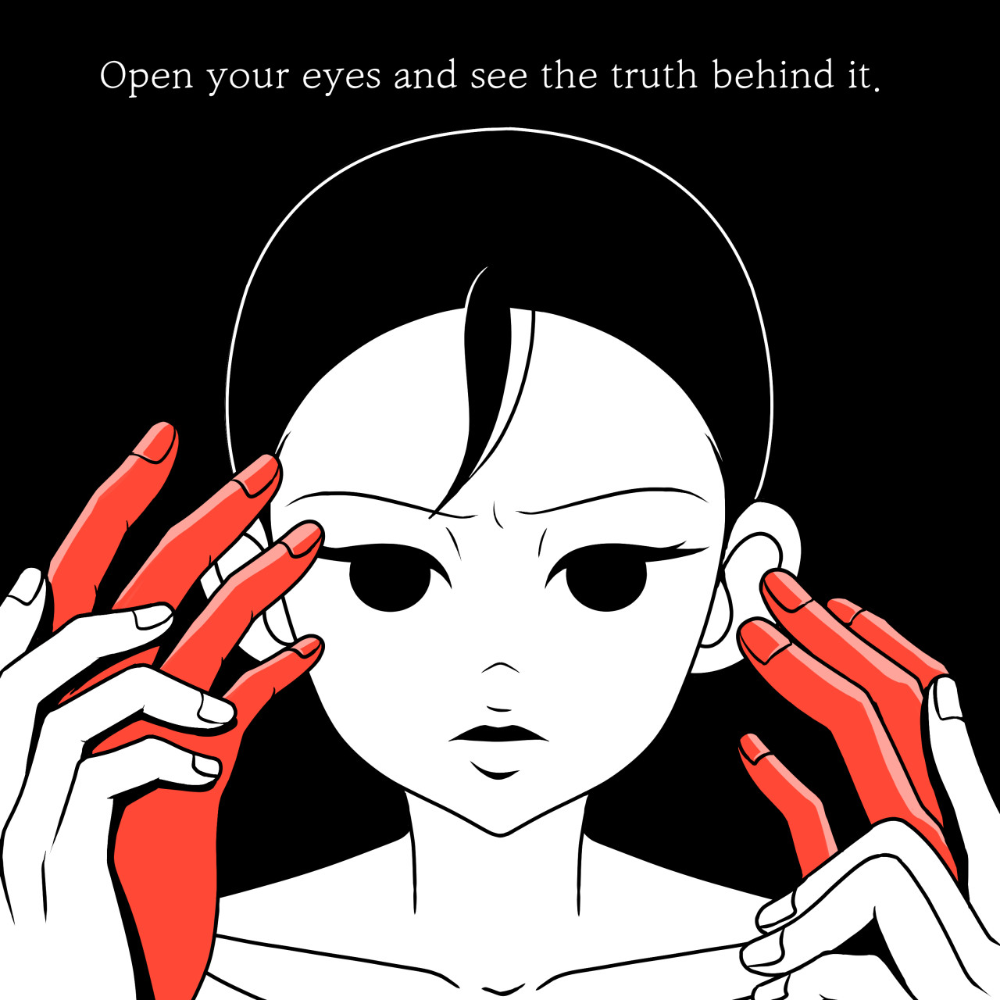

<!--StartFragment-->

Have you ever been struck with a moment of truth you realize you have been completely ignorant of? Walking on an empty street on a typical Monday morning, my footsteps automatically headed to the bakery that I always stop by whenever I visit Garosugil. Like always, I picked up the shop’s best-selling madeleines. As soon as I wandered back outside, however, the pair of windows on the side of the shop caught my attention. It felt so strange because it was my first time noticing it – how could it be? The glass windows had tints of green and blue so vibrant that it seemed humanly impossible for anyone to never have noticed it before.

Upon pondering on that memory since the incident, I shared the experience with my closest friends. To my surprise, my friends responded that they were experiencing something similar as well. What was always present yet imperceptible in life began appearing in front of your eyes with this stranger-like quality, where new changes also started to come into sight better than before. The common factor in our experiences was that we felt like we were losing a part of ourselves. At the same time, however, we could not break from our familiar routine. Especially amid prolonged periods of the pandemic, I was confronted with the fact that reality tends to steal our opportunities to discover unexpected yet remarkable aspects of the world. Truth is often obscured in our unconscious reality – the reality which is always present but which we have not processed. Yet, there are ways to make a conscious effort to prevent this as much as possible. To begin, we must recognize that we are missing a lot of truth without our knowledge.

Truth refers to the abstract condition in which one feels the most comfortable – it could be one’s personality, friendships, hobbies, or life goals. Thus, everyone’s “truth” is different. It is important to keep hold of this truth, for people struggle to adapt to new situations and maintain the original bodily balance with which they are born. The balance is preserved only when all of its parts function properly – like how the taste of madeleines not only depends on fresh ingredients but also the shape, density, texture, and more. Everyone’s bodily balance is determined by daily aspects of life such as personality, relationships, and goals. If the balance is disrupted, the body generates both metabolic and mental reactions that can cause extreme suffering. This adverse impact leads one to enter a cognitive cycle of negativity and helplessness. Sustaining one’s own “truth” does not mean maintaining a fixed structure of life since it is inevitable for life to bring unexpected events. Instead, “truth” means to sustain the ability to recognize who we are and what we pursue – in short, to “be ourselves.”

One effective way to achieve this state of preserved truth is to create a unique outlet of escape from reality. It is crucial that the channel is distinctive. People often mindlessly turn to the Internet or some other social network like YouTube or Instagram whenever they need advice or know-hows to anything of their interest. However, developing this habit is extremely dangerous because it can make one wholly dependent on external help. It could disable even the thought of undertaking problem-solving alone. Alternatively, having an outlet of escape that is specific to your interests and accommodates your needs facilitates the process of restoring bodily balance when something causes you distress. For instance, my outlet of escape is swimming. Under any circumstances, I can recover my mentality by swimming. Though others may also enjoy the act of swimming, this outlet is unique to me because I grant my own meaning and significance to the action. If you have not found such an outlet yet, you should consider actively engaging in role playing – making yourself believe you are someone else in a particular situation. Once you put yourself in someone else’s shoes, just follow your intuition. If something does not feel right, move on until you find the outlet you click with.

Truth is often obscured in a repetitive environment – a school for students, workplace for office workers, sports facility for athletes. Heidegger states in his famous philosophical work Basic Questions of Philosophy that wonder – the basic disposition that “displaces us before everything in everything” – puts the individual before the usual. This is where what is most usual becomes the most unusual. The most usual is what constitutes everything around us. However, it is not anything particular that has shown itself as a singular determinate object. The moment we encounter everything in pure, untouched form through wonder, we come to realize the many things we take for granted. When we stop for a moment and contemplate on the usualness of everything, we face a disturbing realization that we do not possess actual knowledge on these things. For instance, one can wake up and suddenly start questioning why the closet in front of him is called a “closet.” Being overwhelmed by the revelation of such information (or the lack thereof), his mind will start concentrating on the newfound issue even more than other matters at hand, like fixing the bed or taking out the trash.

Once one has realized that elements of his habitual life patterns are causing problems and concealing “truth” from him, he would want to break out of it. However, it takes 21 days for a new and solid habit to form, so departing from an old habit would equally be difficult to accomplish. Besides, people cannot completely detach themselves from an environment they are required to visit on a regular basis. In this sense, the method I described beforehand – such as finding and stabilizing your own unique outlet of escape – becomes even more essential. By having access to a state of comfort that you can always rely on, you gradually see yourself evolving into a chameleon. You would stop finding it challenging to adjust to new, unfamiliar environments and thus get closer to preserving the “truth” in yourself.

Sources

Picture 1:

<http://westerncarepartners.com/the-art-of-not-losing-yourself/>

Picture 2:

<https://www.talenthouse.com/item/2293179/42f48cca>

<!--EndFragment-->