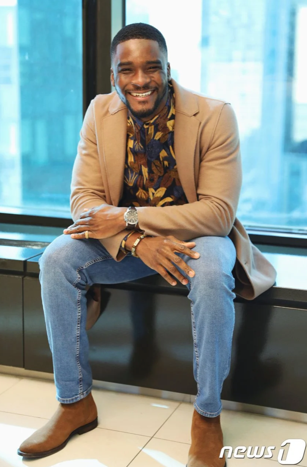

Blackface, a demeaning depiction of black people by painting one's face black, originates from a racist history invoking the affliction of oppression, derision, and slavery. As a performance convention in American theaters since the 1830s, when slavery, lynching, and segregation was prevalent, blackface has contributed to the dehumanization and confinement of black people within racist paradigms. When five students from Uijeongbu High School used blackface to portray the “Dancing Pallbearers” for their graduation picture, Sam Okyere, a Ghanian celebrity mainly active in Korea, brought this incident to light by calling the students out on his Instagram post. His post ignited heated controversy on whether his criticism was valid, ironic, or even reproachable.

## Things to Set Straight: Linguistic Ambiguity and the Fallacy of Ad Hominem

Before assessing the intricacies of the issue, the feeling of antipathy many felt towards Okyere must first be quelled. That is, linguistic ambiguity in Okyere’s Instagram post and the fallacy of ad hominem have further heightened the hostility projected towards the TV personality. Okyere’s comments that “this ignorance cannot continue” and must be remedied with education ignited the anger of many Koreans, as they took his post to be condescending. Although the importance of education to resolve the national ignorance of the history and perception of racism is highlighted in the U.S., it is not as widely discussed in Korea. This resulted in many Koreans misconstruing the suggestion of ignorance and the lack of education as expressions of derision. Although Okyere did not aim to censure the Korean education system, the nuance of his post led to many misinterpreting his remarks.

Much of the criticism towards Okyere has been tainted with ad hominem attacks. Some have suggested the irony of his objection, stating that Okyere has displayed anti-Asian sentiment on numerous occasions on television. However, to properly assess an argument, we must digress from such logical fallacies and weak rebuke.

## Sources of Criticism Against Okyere

Many have castigated Okyere for posting the students' picture without their permission and not respecting their privacy. By publicizing a photo of the students without carving out their faces, Okyere disabled the opportunity for the students to personally grow through this incident, and instead, imposed an irrevocable national stigma on them. Okyere admitted his faults in this part and apologized.

Koreans who disliked and were exhausted with political correctness stated that Okyere’s response to the high school students’ blackface was excessive and unnecessary. Appropriating the phrase “when in Rome do as the Romans do,” they claimed that the use of blackface by the students should not be seen as offensive, but rather as a source of humor in Korea, where the issue of blackface is not pronounced in the media or education curricula and thus ostensibly “irrelevant.” This line of thinking is greatly questionable. We currently live in an interconnected international society. There is no “Rome” and no fixed manner of how the “Romans do;” we are members of the “global community” who must “do as global citizens do.”

## **The Validity of Okyere’s Argument**

A mutual agreement exists amongst all interest parties that the students in the photo did not have a malicious intent. However, intention does not matter as much as the connotations blackface carries as well as its (unintended) consequences. Blackface exacerbates the subjugation of already marginalized communities due to its offensive nature. As it embodies the mockery historically projected towards the marginalized, its repeated use perpetuates the vicious circle of systemic racism, causing black communities to feel hyper-visible and neglected at the same time. Deeming blackface as humorous derives from a position of privilege, where people do not realize the emotional distress it imposes on black individuals.

Some Koreans have also tried to trivialize the issue by suggesting that “white face” is a form of “reverse racism,” a notion that anti-racism campaigns are oppressing historically privileged groups — and that it is no different from blackface. As such, many tend to regard blackface without the gravity it is associated with — it is a mere meme to those who are not aware of the racial injustice and atrocities inflicted upon black communities throughout history. Since there is no history of systemic oppression against privileged groups, the argument of “reverse racism” simply fails to stand and only undermines the racist history of racial discrimination.The backlash in Korea against Okyere’s objection to the blackface photo occurred due to cultural disparity and a general lack of awareness of blackface, rather than racial antagonism. Our faults can be corrected with conscious, persistent effort. Now that we have experienced such an incident, reasons including the “lack of awareness” or “cultural difference” must not be used as an excuse to turn a blind eye to a practice that marginalizes a group of people. To progress as a responsible member of the global society, Koreans must acknowledge the deep scars of black history and endeavor to redress the remnants of our past injurious social constructs.