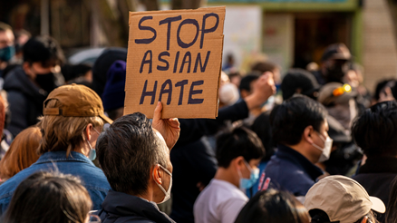
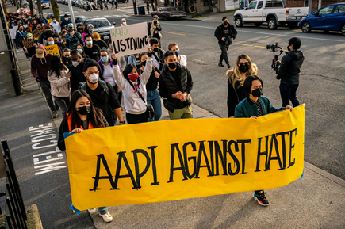

<!--StartFragment-->

March 16 marked the peak of Asian Hate latent in the United States. With a series of mass shootings in Atlanta-area spas, eight people were murdered—out of which six were Asian women. The incident met public outcry against the rise of anti-Asian sentiment.

The Atlanta spa shootings have thrust the international community into a direct confrontation with uncomfortable truths: although the international society is more interconnected and interdependent than ever before, cosmopolitan norms and values are yet firmly established. In fact, globalization has entailed counter-intuitive outcomes of nationalism and populism. The rise of Asian hate has not only shed light on the demoralization of the globalized world but also on the dire cultural consequences of the prolonged COVID-19 crisis on international stability. Likewise, Anti-Asian hate crimes reflect the flaws of an erroneously glorified “mature modern democracy.” Such obstacles to coexistence must be overcome to advance towards a peaceful democracy.

The roots of Asian hate can be traced to historically racist and discriminatory occurrences from 20th century America. Incidents include: the rejection of the Racial Equality Proposal in 1919 and Japanese internment camps during the Second World War. Innocent civilians were discriminated against, and many were unjustly arrested. In the Post-Cold War period, the emergence of China as a global power has also spurred fear and Sino-US hostilities. Asian hate has only worsened due to COVID-19 and the rise of Sinophobia. Sinophobia was especially highlighted under the Trump regime where the U.S. president himself referred to COVID-19 as “kung flu”, implying an association between the Chinese and the outbreak of the virus.

More than just a palliative measure, there must be plans to address the issue from a structural standpoint. In a way, Asian hate can be explained by the Broken Window Theory. The Broken Window Theory states that signs of crime and violence can lead to further social disorder. Hence, if hate speech against the historically oppressed is prevalent, hate crimes against such vulnerable groups are very likely to occur. Such thought involves various dilemmas. Most predominantly: the debate on whether hate speech should be regulated. Free speech is considered as a core value of democracy and political rights. However, such rights may bring undesirable consequences. In such cases, should rights be limited to promote the common good? When answered with a yes, more questions arise. For instance, who should be given the power to decide the extent of speech regulation? The criteria of what contains “hate speech” itself is extremely nebulous and will undoubtedly incite controversy. Continuous debate on such issues will help renew the vitality of democracy. What is clear is that freedom of speech should not be abused to threaten liberal democracies; it should be catered towards building a more sustainable community through robust communication.

In addition to the deliberation on methods to amend the structural foundations of society, various pragmatic measures must take place. Fortunately, some have already been implemented. The Biden administration has officially claimed to tackle Asian hate, proposing various measures such as: increasing funding for survivors, encouraging research on xenophobia, and expanding the Justice Department to establish a system more effective in containing and reporting hate crimes. Furthermore, the Asian American Journalists Association (AAJA) has proposed guidance on how to cover the issue so journalism does not lead to worse ramifications, making vulnerable communities more vulnerable. Thus, the media must ensure an objective representation of the shooting and other hate crimes as imprudent portrayals can create further stigma for the victims.

Civil society has also been active: notably, Stop AAPI Hate, a nonprofit organization established in 2020, conducts analyses and research on the current status of Asian hate. Individual citizens can make a difference by proactively engaging in such relevant organizations. In the Digital age, anyone can contribute to the endeavor to stem irrational hate against Asians; it can start with small actions, such as raising awareness through social media platforms. To save democracy, we all must take a role in prudently using the advantages it gives us.

**Time Magazine <https://time.com/5947603/how-to-help-fight-anti-asian-violence/>**

**The Keyword <https://blog.google/outreach-initiatives/diversity/why-im-speaking-out-against-anti-asian-hate/>**

<!--EndFragment-->