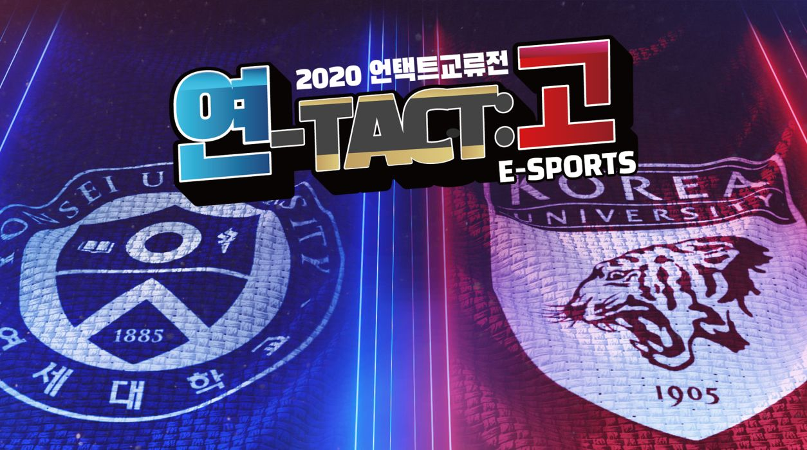

Ever since coronavirus began spreading rapidly around Korea, there have been numerous restrictions set in place, and festivals are part of it. Every Yonsei University student will agree that attending school festivals such as Akaraka and Yon-ko games is the highlight of the year. However, since last semester, all of these events have been cancelled and delayed in the hopes of returning when coronavirus stopped. Since spring 2020, the annual Akaraka concert expected to be held in May 2020 was postponed until the following semester. Yet, it remains cancelled even past October. A similar thing can be said for the Yon-ko games. The annual sports competition between Yonsei University and Korea University is held in early October, but this too has been cancelled.

To some students’ surprise, however, the schools did arrange a digital festival to cheer up the students. Although we don’t get to experience the same excitement from being present in the field or the stadium and cheering our athletes on, this virtual event was an adequate alternative and certainly brightened up the student body.

In mid-June, Yonsei and Korea Universities hosted an online live joint cheering session to raise the students’ spirits. An online platform broadcasted the cheer squad at the stadium, cheering and dancing to the music. The students at home were able to follow along and cheer as well. There were three parts to this event. The first part, termed “Harmony,” included the Akaraka squad and the students at home tuning in from their laptops. They sang along to the songs and harmonized together in unison. The second part, called “Competition,” consisted of a match between the cheering squads of the two universities and MC representatives of each school hosting this event. Lastly, the finale concluded the event by once again cheering and lifting the spirits of every participant involved. This inspiring event sought to make up for the absence of events in the previous semester, and although the students weren’t able to be there in person, they were there in spirit to be a Yonsei-in.

The online event replaced the joint cheering session and Akaraka, but what about the Yon-ko games? The Yon-ko games first began in 1956 and featured five sports events – soccer, rugby, basketball, baseball and ice hockey. These matches take place annually during the fall semester and hadn’t been cancelled since 1996. This year, the entire event was called off due to the fear that the athletes and the students might catch the coronavirus. Thus, instead of a sports-based competition, the schools arranged “Yon-tact-Ko,” a cyber Yon-o event consisting of online games like the League of Legends, Overwatch and Kart Rider. The games began on the 15th of October and ended on the 16th of October, after going through a preliminary round to select the players. Yonsei University beat Korea University, by winning four out of five games. The whole event was streamed online, garnering thousands of views and viewer participation. In addition to the cyber gaming events, the schools hosted dance covers and duets to showcase the talent from both schools.

Although the cyber Yon-ko games cannot entirely recapture the riveting experience you get from cheering in the crowd of fellow students, this event nonetheless demonstrated how we can still organize school competitions and have fun in the midst of the pandemic. The online events prioritized the health of everyone involved, and kept up the students’ school spirit and high hopes. Since vaccines or treatments for the coronavirus are currently unavailable, this is perhaps how all future festivals will be held – online. Even though there are still some areas for improvement, this was a great first attempt at relieving the student body’s despair over the cancellation of school events and ensuring the continuation of cherished school traditions.