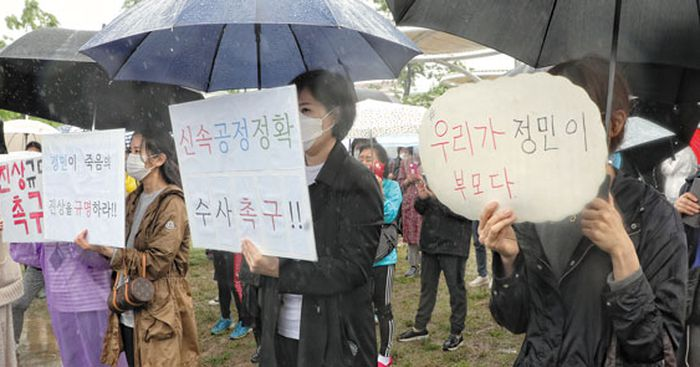

<!--StartFragment-->

The night of April 24, 2021, 22-year-old Jeong Min Son went drinking at Banpo Han River Park with a friend from college. While the friend drunkenly found his way home, Son did not. His parents promptly reported him missing and requested a police investigation. Yet due to the friend’s alcohol-induced memory loss and an unexpected dearth of surveillance cameras in the area, the investigation was slow to make significant progress. The story quickly gained traction through social media and Son Sr. 's travel blog, eventually making national headlines and prompting extensive civilian rescue missions. Five days later, Son’s body was found floating in the Han River, not far from where the two had last been seen. A subsequent autopsy by the National Forensic Service found no fatal wounds and ruled Son’s death to have been caused by drowning.

Yet Son’s father publicly denounced these results on televised interviews, instead querying the “suspicious” circumstances of his son’s death. How did Jeong Min end up in the river? Why did the friend dispose of the shoes he was wearing at the scene? Why did he show up to his police interview with his lawyer? The South Korean public and media responded to these conjectures with an overwhelming amount of attention: Son’s story headlined major news outlets for weeks, while multiple memorial services attracted thousands of citizens from all corners of the country. Most disturbingly so, the entire country seemed to presume the friend to be undoubtedly, unequivocally guilty. Conspiracy theories about how law enforcement was covering for the friend spread like wildfire: some rumors claimed the friend’s father to be a powerful politician, others that his uncle was the district police commissioner. Youtube videos endorsing such rumors racked up tens of thousands of views, while a national petition demanding a close investigation of the friend garnered over 460,000 signatures. On a 2020 promotional school video featuring both Son and the friend, the comment section flooded with vicious personal attacks on the friend — that he seemed sleazy, untrustworthy, evil, and jealous. Netizens uncovered sensitive personal information on the friend and bombarded his father’s business with so many negative reviews that it temporarily closed shop. As of June 2021, police investigations and numerous independent professionals have concluded that there is no evidence of foul play in Son’s death. Yet the conspiracy theories show no sign of abating.

Two major societal issues have been elucidated by this case. First, ludicrous and blatantly false conspiracy theories have gradually been entering mainstream media via Youtube and internet forums. Whereas mainstream media used to shape online discussion, the direction is now reversed: as in this case, popular rumors and baseless gossip now make their way to top media outlets. This may be partly due to the recent plethora of corruption scandals making the Korean public wary of power dynamics and authoritative figures. However, the constant skepticism and conspiracy theories do little to correct corruption. Second, the presumption of innocence may be true in legal terms, but holds little weight in non-legal discussions. A father should never have to send his son off. But that cannot justify publicly presuming the guilt of another person without substantial evidence beyond reasonable doubt. The Korean public preaches about justice for Jeong Min. Who’s upholding justice for the friend?

<!--EndFragment-->