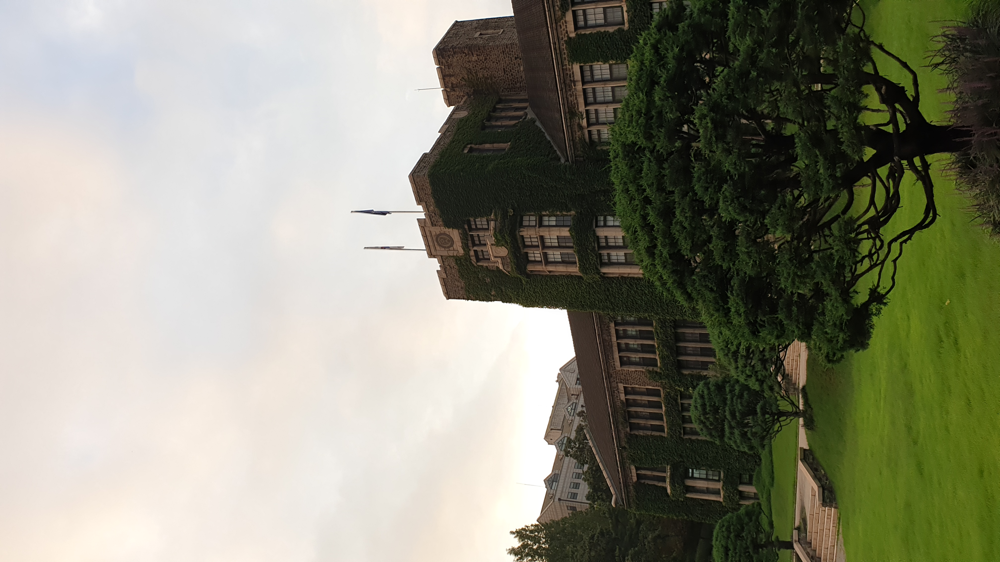

Even amidst this global pandemic, Korea’s borders are open, allowing foreigners to enter the country, provided that they follow the mandatory two week quarantine. For some students, that means a study abroad program in Yonsei is still a viable option. For others, the relatively safe situation in South Korea has prompted them to stay in Korea even after their plans to study abroad here were over. Whatever the case, Yonsei currently has an abundance of exchange students, and I had the opportunity to ask them a few questions about their experience.

The first interviewee is Soo Yeon Park who is on exchange here at Yonsei as an Electrical Engineering major. She is originally an Applied Physics major at Wellesley College.

**Q:** Why did you choose Yonsei as your study abroad school?

A: I chose to come to Yonsei primarily because of safety reasons. It seemed like the coronavirus cases in the US were rising, and on the other hand Korea seemed super safe. I’m originally from Korea but never got to live here and really learn the language so I thought it was the prime opportunity to do so. I chose Yonsei specifically because of their reputation, the location and it had many courses in English.

**Q:** What were your expectations coming to Yonsei?

**A:** I didn’t really have any specific expectations. I actually didn’t expect it to be online so I was really disappointed about that. One thing I would really like advice other exchange students from the US is the lack of engagement the professors have overall with students, maybe it’s because it’s online but I found it difficult to know anything about a professor's research or found it difficult to reach out to them. I also found other students in my dorm experience the same things with their professors.

Socially, I was so glad I got to join the clubs here and make friends with Yonsei students. I found that the clubs were super welcoming. I am currently in the Yonsei rowing team as well as the womens’ soccer team. The sports teams are also very different from the US as it’s very distinctively a club. It was actually difficult to find clubs that were recruiting, maybe because it wasn’t targeted towards exchange students at all but overall. I love that part of my life here.

**Q:** That's a relief! Would you say that you are satisfied with your current situation as an exchange student at Yonsei?

Overall I’m very satisfied with the study abroad program. I really felt like I hit all the marks. I was able to engage with the students here even though COVID made it difficult. I liked the location and just how I was able to really learn about Korean culture and the language through my courses and just living here. The only thing is again, I didn’t expect to really self study as much as I had to. Professor engagement and the overall quality of classes were not really what I was used to. Other than that I didn’t regret my choice at all and I am satisfied!

The next person I interviewed is Daniel Cho, coming from the College of New Jersey 7 year Medical Program partnered with Rutgers New Jersey Medical School. He is currently a Biology major here at Yonsei.

**Q:** What made you choose Yonsei to study abroad at?

**A:** I chose Yonsei mainly after my other options for study abroad locations experienced spikes in COVID cases. I did know Yonsei was a reputable school that provided quality education that was also available in English and had an international student population.

**Q:** Did Yonsei meet your expectations, or did you get a whole other experience compared to that?

**A:** My Yonsei experience fell short of my expectations not because of the school itself but due to the current pandemic. I was not able to meet my classmates in person, and I found that it was hard to find people at Yonsei to actually go out and do activities with because there wasn’t really an opportunity to do that. The people I ended up going out with are people I befriended at bars and other locations that were not school related. In terms of academics, the class for my major is quite challenging and forces me to really take the time to learn the material independently.

**Q:** Are you overall satisfied with your study abroad program? Why or why not?

**A:** I am extremely grateful to be able to go and study here in South Korea, in a country that has mostly been able to handle the spread of the novel coronavirus. Although it is not over yet, I got to experience my culture in a way that I would not have been able to experience in America. I got to fully immerse myself in Korea by going out and talking with people who actually live here and hear their ideas about life and their dreams for the future. Getting to meet new people who have experienced a completely different life from me is so rewarding because I would not have been able to have that dialogue back at my college. Overall, I think my experience at Yonsei may have fallen a bit short of my expectations, but physically being in Korea and getting to really dive into life here has been truly amazing.

Overall, Yonsei is still accepting exchange students and the students here are satisfied with their experience. With the ‘Winter at Yonsei’ program starting this winter break and a new semester coming next spring, students from all over the world may consider Yonsei as one of their options.