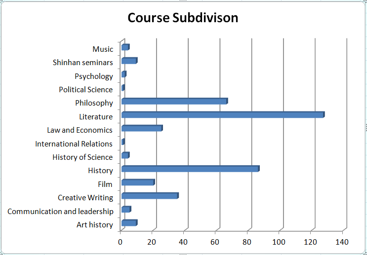

<!--StartFragment-->

How should we apportion seminar classes at UIC? This question concerns more than simply the numerical distribution of classes and allocation of faculties. There are deeper implications in answering this question. What values drive and define UIC? What identity do we want the students to embody as they transition into society? Every great piece of art stirs vibrant intellectual discussions, forever influencing thoughts. A great education should not be different at all.

UIC seminars, the final hurdle of the Common Curriculum(CC), are advanced courses designed to provide students with chances to delve more deeply into specific areas of academic research, explore the creative arts, and develop professional skills. They cover a wide range of subjects broadly organized into three categories: advanced topics in humanities (history, literature, and philosophy), creative arts studies (creative writing, filmmaking, and music), and career-oriented subjects in business and law. These seminar classes not only offer students opportunities to hone their critical thinking skills, but also allow interactions between students from diverse disciplines, fostering interconnectivity within the UIC community. Since the 2014-1 semester when HASS and ISE divisions have been formally established, there have been in total three hundred ninety-four classes. According to the UIC Curriculum and Academic Regulations booklet, the three categories mentioned above — humanities, creative arts, and career-oriented studies — are subdivided into twelve specific areas: Art history, Communication and leadership, Creative Writing, Film, History, History of Science, International Relations, Law and Economics, Literature, Philosophy, Political Science, and Psychology.

There has recently been issues raised against the ratio between the number of classes hosted in different fields. After organizing the seminar classes into the three categories mentioned on the UIC website, there have been three hundred five classes conducted in humanities, fifty-nine classes in creative arts, and thirty classes in career-oriented subjects in business and law. There is a distinct disproportion to be observed with classes in humanities constituting seventy-seven percent of the entire common curriculum courses. There is an imbalance of distribution within the humanities field as well: only eight of the three hundred and five were classified as social science and science classes. The conclusion would be that there is a clear scarcity of classes oriented around social science, science, law, and practice-based fields. In fairness, labeling classes by arbitrary categories of UIC can be misleading as there are many interdisciplinary courses offered. For example, a class such as “Topics in Economic history” straddles economics and history. Still, the remarkable lack of social science, science, law, and practice-based fields should not be lightly dismissed.

When inquired about this issue of the imbalance between fields of study in seminar classes, Professor Kelly Walsh, the current chair of CC, solicited the students to shift their perspectives to the unique identity of UIC as a liberal arts institution. While he assured that he understands the pressure on students to be equipped with specialized competencies in today’s job market, he maintained that liberal arts education imparts to students the capability to understand and converse knowledge in diverse disciplines, which will enable one to adapt faster in a workplace. He wished to remind us that “the idea of liberal arts education has traditionally been grounded in classical languages and literature. Natural and social sciences did come into play later, but liberal arts, in its earliest conception has always been based on humanism, including literature, history, philosophy, etc.” He explains that specialized training in a certain field is reserved for major courses and should be pursued in more depth at graduate schools. His belief is that seminar courses “challenge you to think independently and cognitively connect and network existing elements to create something new. You are being trained to think, imagine, and create.” His argument is that as a liberal arts institution, the exceptional weight placed on humanities is only natural. Consequently, the common curriculum faculty of UIC is predominantly composed of humanities scholars, and therefore, there are more humanities seminars.

However, he also suggested a potential solution that could satisfy the need for diversity in seminar courses. He indicated that it is possible for professors from other disciplines, even other colleges, to host seminars if they are willing to volunteer for it. There have been instances where professors from other Yonsei departments were invited to teach. In 2016-2 semester, a professor from the Department of Psychology (College of Liberal arts) offered UIC 3525 “Abnormal Psychology”; in 2015-2 semester, a professor from Yonsei Law School opened UIC 3650 “Perspectives on Law in Society.” The challenge is that it would be a substantive increase in burdens for them as they would be tasked with one more class, including all the administrative processes.

In the end, students should actively voice their interests to the relevant professors, as professors very often consider student interests when designing their classes. There should be attempts, however small, for mutual communication between the students and the school for a change to take place. It all begins with baby steps.

<!--EndFragment-->