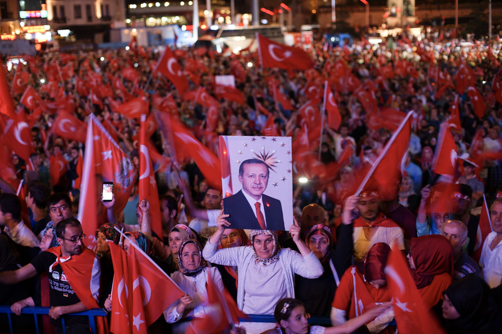

On July 15, 2016, the Peace at Home Council, organized by members of the Turkish military who were unhappy with Erdogan’s near-dictatorial consolidation of power, deployed military forces to Istanbul and Ankara. Despite being well organized, anti-government forces failed to neutralize Erdogan or take control of Turkish media outlets. This meant that they were unable to garner support from the general population. By the time Erdogan arrived in Istanbul, the coup was effectively over. The incident, rather than undermining Erdogan, provided a pretext for him to consolidate power. Now, he can implement a more assertive foreign policy without domestic backlash.

Erdogan’s first target was Syria. Turkey has been involved indirectly in the Syrian civil war since its outbreak in 2011, and launched a minor attack on an Islamic State (IS) held town of Jarabulus, Syria in August 2016. However, in October 2019, it invaded greater northern Syria, an action justified by its announced plan to combat dangerous Islamis extremists. However, Turkey was roundly criticized for targeting Kurdish forces instead. Turkey, which has a significant Kurdish minority in its border region with Syria, has taken Kurdish nationalism to be a threat to its sovereignty.

Only three months after the intervention in Syria, Erdogan announced his intentions for military intervention in Libya, which has been embroiled in a second civil war since 2014 after the overthrow of President Muammar Gaddafi in 2011. The Government of National Accord (GNA), based in Tripoli, was recognized by the United Nations in 2015 with unanimous backing from the UN Security Council. Currently, however, most Western governments support the House of Representatives and Turkey remains the faction’s only major patron. Libya is strategically important to Turkey because of its plentiful oil reserves and long coastline. Controlling Libya would allow Turkey to meet its energy needs as well as being able to influence the greater Mediterranean.

The dispute in Libya is part of broader competition in the Eastern Mediterranean and Aegean for resources and influence. Turkey has become increasingly assertive in the region; Turkish research ships and fighter jets frequently enter territory claimed by Greece. In addition to this, Turkey and the GNA signed the “delimitation of maritime jurisdiction” agreement regarding the Eastern Mediterranean which was deemed unacceptable to other local powers. As a result, a coalition composed of Greece, Egypt, Israel and France is developing to counter Turkey in the conflicted region.

Turkey supports Azerbaijan in its ongoing conflict with Armenia over the Nagorno-Karabakh region, which is nominally under the jurisdiction of Azerbaijan, but ethnically Amernian. Turkey has been accused of directly deploying forces to the region, an allegation it denies. This is not the first time fighting has erupted in the region. However, now, both parties are richer and better equipped. Azerbaijan had previously backed off in disputes with Armenia due to Russian pressure. However, with Turkish support, the conflict is likely to re-escalate.

Turkey’s relationship with the US is no better. US-Turkey relations had been deteriorating since the end of the Cold War. The two allies clashed on several important issues, such as, American support for Kurdish forces in Syria. The ambiguous response of the West on the 2016 Coup led to even more tensions between the two countries. As a result, Turkey purchased the Russian made S-400 air defence system, provoking the US to cancel the delivery of American-made F-35 fighter jets.

With the diminishing friendly interactions with the US, there had been signs that Erdogan was seeking détente with Russia in recent years, as can be illustrated by its purchase of the Russian air defence system. Yet, due to the ongoing conflict in the Caucuses, Russo-Turkish relations are likely to remain shaky. Moreover, as Turkey and Russia are the two strongest, and rivaling, regional powers, any improvement in relations is unlikely to be permanent.

It is natural for rising powers, such as Turkey, to be more assertive. However, one cannot help but think that Erdogan has overplayed his cards. Erdogan has completely isolated his country by simultaneously antagonizing the two most influential outside powers in the Middle East; the US and Russia. Moreover, local powers which had been malleable and even friendly to growing Turkish influence have begun to view this new assertive Turkey as a threat. Only time will tell whether Erdogan will rethink his foreign policy and stabilize Turkey’s ascent into a great power or continue squandering his country’s innate advantages.