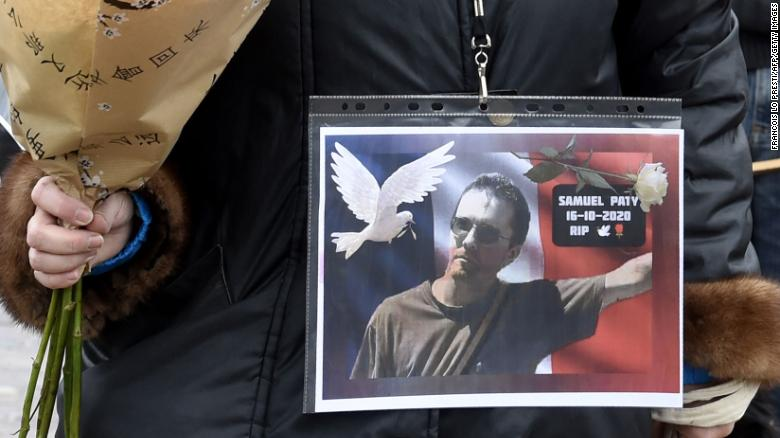

On October 16th, Samuel Paty, a 47 year old French middle school history teacher, was beheaded in [Éragny](https://en.wikipedia.org/wiki/%C3%89ragny,_Val-d%27Oise), a place nor far from his school. The killer was identified as an 18-year-old Muslim Russian immigrant Abdullakh Anzorov who was shot dead by police after the attack.

The teacher had been the target of threats from furious parents who demanded his resignation after he showed a cartoon depicting the Prophet Muhammad naked during a class about freedom of speech on October 6th. It is known that such [depictions of the Prophet Muhammad are seen by many Muslims as offensive](https://www.bbc.co.uk/news/world-europe-30813742) because the Islamic tradition explicitly forbids images of Muhammad and Allah. This has been a particularly sensitive issue in France ever since the Charlie Hebdo shooting in 2015, when two armed Muslim brothers raided the Charlie Hebdo office after the French satirical magazine decided to publish cartoons of the Prophet Muhammad. This incident killed 12 people and injured 11 others.

The gruesome attack against Samuel Paty spurred demonstrations in support of freedom of speech across France. Not long after the murder however, France faced another attack on October 29th. Three people were violently attacked at a church in Nice. A 60-year-old woman and 55-year-old man suffered cuts to the throat and died inside the church. The third victim, a 44-year-old woman, managed to flee alive to a nearby cafe after being stabbed several times, but died at a nearby restaurant later.

State secularism is central to French national identity. This idea is based on respect for freedom of expression and freedom of religion. Embracing state secularism, or ‘laïcité’, means that the state does not favor one religion over another, and that public spaces such as classrooms or workplaces should be free of religion to guarantee the peaceful coexistence of different ideas. Many believe that curbing freedom of expression to protect the feelings of one particular community, undermines the country's unity.

Whether depictions of Allah or the Prophet Muhammad is an individual’s right to expression or unnecessary provocation however is controversial. President Emmanuel Macron’s refusal to denounce satirical depictions of the Prophet Muhammed, and subsequent defense of the right to publish controversial cartoons under free speech laws sparked outrage in the French Muslim community and in Muslim-majority countries around the globe. This deepening social divide over religious expression and individual freedom of speech is a complicated mixture of moral questions. Although state secularism intends to divide the public sphere and private life, where religion belongs, this is viewed by some as an infringement upon the believers’ right to manifest religious endeavors. The mistreatment of the French Muslim community which frequently faces discrimination because of their faith, only makes the situation even worse. Social marginalization experienced by many Muslim immigrants and their descendants in France cause disillusionment and furthers the divide between the Muslim community and the rest of French society. Whether and how France will overcome this social divide remains to be seen.

As a culturally diverse country, France aims to integrate people through the adoption of the French beliefs, values and behaviors. Cultural integration entails a dual process where immigrant populations celebrate their heritage and embrace local customs and attitudes. Yet, this is often a great challenge for culturally diverse countries due to the immigrants' inability to integrate into local customs and the host society's inability to accept immigrants as equals. Remaining connected with and respectful toward diverse cultures around us is a great step forward for cultural integration.