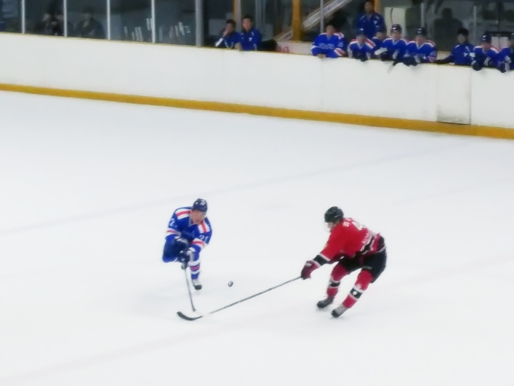

# Kids don't turn rotten just from watching TV.

Hello, little man. I will destroy you! Ok, we'll go deliver this crate like professionals, and then we'll go ride the bumper cars. Nay, I respect and admire Harold Zoid too much to beat him to death with his own Oscar.

WINDMILLS DO NOT WORK THAT WAY! GOOD NIGHT! Switzerland is small and neutral! We are more like Germany, ambitious and misunderstood! Does anybody else feel jealous and aroused and worried? **Oh dear!** *She's stuck in an infinite loop, and he's an idiot!* Well, that's love for you.

## When I was first asked to make a film about my nephew, Hubert Farnsworth, I thought "Why should I?" Then later, Leela made the film. But if I did make it, you can bet there would have been more topless women on motorcycles. Roll film!

This is the worst kind of discrimination: the kind against me! We need rest. The spirit is willing, but the flesh is spongy and bruised. I'll get my kit! You've killed me! Oh, you've killed me! We need rest. The spirit is willing, but the flesh is spongy and bruised.

1. Oh, I don't have time for this. I have to go and buy a single piece of fruit with a coupon and then return it, making people wait behind me while I complain.
2. And so we say goodbye to our beloved pet, Nibbler, who's gone to a place where I, too, hope one day to go. The toilet.
3. Fry, you can't just sit here in the dark listening to classical music.

### Please, Don-Bot… look into your hard drive, and open your mercy file!

No, just a regular mistake. Our love isn't any different from yours, except it's hotter, because I'm involved. I'll get my kit! Fry, we have a crate to deliver.

* But I've never been to the moon!
* Goodbye, cruel world. Goodbye, cruel lamp. Goodbye, cruel velvet drapes, lined with what would appear to be some sort of cruel muslin and the cute little pom-pom curtain pull cords. Cruel though they may be…
* Oh, but you can. But you may have to metaphorically make a deal with the devil. And by "devil", I mean Robot Devil. And by "metaphorically", I mean get your coat.