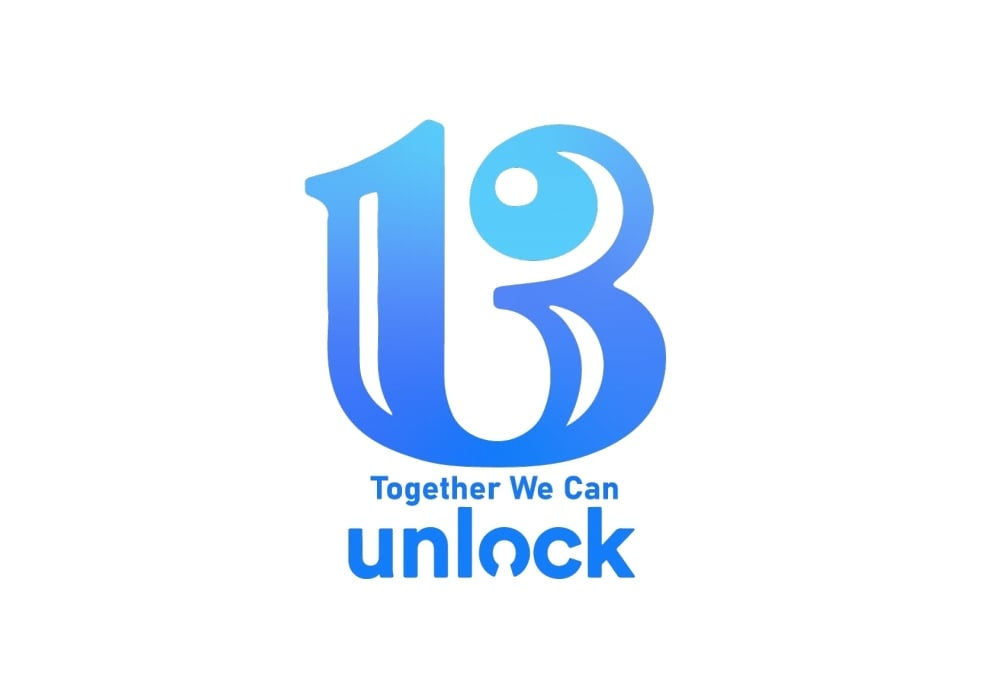

<!--StartFragment-->

After more than three years of operating without a student council, Underwood International College successfully held its 13th election from April 6 to 8, 2021. Previously, the lack of qualified candidates resulted in the nullification of annual elections and the ad-hoc formation of the ‘Emergency Exigency Committee,’ which underwent changes in leadership 12 different times among members from the UIC Student Union Club or Major Student Council.

This year, Jin Hyeok Park (STP major, Class of 18) and Sea Jin Kim (IS major, Class of 19) have been elected as president and vice president respectively. The candidates received 92.70% approval across a voter turnout of 1,151 students or 52.34% of the student body. This turnout was just above the required minimum of 50%.

Since the beginning of the semester, the two candidates sought support through their campaign. Together We Can <Unlock> identified problems they wish to address as officers via the Kakaotalk chat rooms of each major and a Zoom hearing session on March 26. Park and Kim highlighted three key themes in their pledges: communication, connection, and ‘UIC-ness.’

First, the candidates emphasized the need for active communication between the students, the student council and the school’s administration. Pointing to UIC’s unique administrative structure, Park noted that UIC students often become alienated from the benefits offered to other colleges in Yonsei University. For example, in early February 2020, the central administration reported plans to provide special scholarships for the Fall semester amid continued COVID-19 economic hardships among some students. So far, however, UIC has been excluded from these provisions because it runs on a separate tuition accounting system, and there has been a struggle to reach a compromise between the General Student Council and the UIC Office. This is just one more incident added to a long list of educational infringements students experienced last year. Students of Yonsei have increasingly voiced frustrations at the unfairness of inconsistent evaluation methods and criteria of online classes, cheating incidents and difficulties for small discussion-based courses. Park and Kim, therefore, have promised to make students’ voices heard by establishing the UIC Academic Affairs Consultation Committee (UAACC), a group that will specialize in the discussion of UIC academic affairs and education rights with the school administration. In order to keep the students updated, they have proposed to disclose regular reports on their meeting’s agenda, participants, and final decisions.

Second, the candidates stressed their plans to foster a sense of connection among UIC students. The transition to online learning has undoubtedly curtailed opportunities for students to network and meet each other. Freshmen students, in particular, have been hard-hit as they struggle to adjust in college without the company of fellow classmates and guidance from upper-classmen. In an interview with a student from Underwood Division Class of 21, she remarked, “I think life’s been generally hard and less meaningful for all freshmen because unless you personally reach out directly to others, it’s impossible to make new friends.” Recognizing such difficulties, the candidates have promised to carry out freshmen welcoming events and reopen programs such as the UIC College Festival “Cheogsong,” “UIC’s Got Talent,” e-sporting matches, among others.

Understandably, some students in the joint hearing session expressed skepticism towards the implementation of activities given the atmosphere of indifference or unfamiliarity with StuCo activities in past years. To this Park, responded that he and the vice president will reactivate the Council’s social media accounts like Facebook and Instagram, which were last updated in 2017.

Third, the candidates mentioned the importance of ‘UIC-ness.’ UIC is renowned for being the only English-language liberal arts college in South Korea. However, students have complained about the lack of variety in courses. For example, though UIC course descriptions list “career-oriented subjects in business and law,” psychology, mathematics alongside social science courses, much of the existing subjects remain in the fields of literature, philosophy and history. Thus, this year’s StuCo has promised to diversify UIC seminars and open them as soon as possible. Moreover, though UIC boasts of its international student body, many have noted the lack of foreign student-friendly services, such as the Korean-only announcements on administrative matters. In response, Park and Kim assured that <Unlock> will improve the notification board so that details on waive periods, graduation requirements, academic calendar, and academic affairs, are all translated to English and promptly delivered.

Let us hope that our new UIC StuCo carries out its promises. It seems that so far, we are off to a good start. Students have been enthusiastic about the Snack Event organized by <Unlock> during midterms, which offered a variety of menus ranging from BigMacs, Subway Veggie Salads to even personalized options for students residing abroad due to COVID-19 restrictions.

<!--EndFragment-->