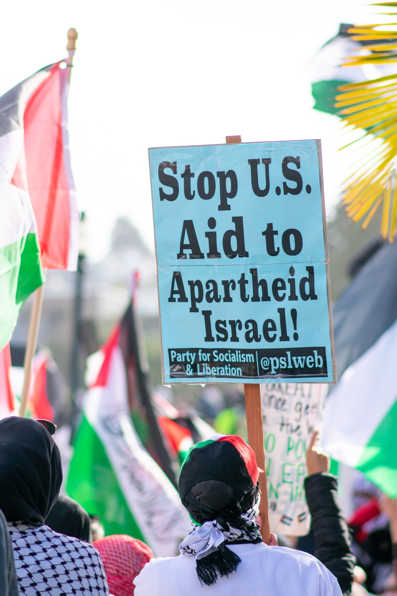

<!--StartFragment-->

The world always has a war or two going on, and as such, we unfortunately learn to get used to them. However, the recent Israel-Palestine crisis would surely rank among the most brutal ones we’ve witnessed this decade, and just as shocking. The 2021 Israel-Palestine crisis has claimed the lives of at the very least 243 Palestinians, among whom 66 were children, as well as twelve Israelis including one child. The Israel Defense Forces, or IDF, claimed on the 11th of May that at least 15 of the casualties belong to Hamas, or the Islamic Resistance Movement. On the 19th, the Palestinian National Authority reported at least 1710 to have been injured, and Israel reported 200, respectively. While the eventual ceasefire on 21st of May put an end to much of the bloodshed, Palestine still remains unstable. Here in this article, we’ll examine how and why this crisis came about.

It’s almost an age-old conflict. The fall of the Osman Empire after World War One meant that Britain came to control the area known as Palestine. Even then, the majority of the people living there were Arabs, and Jews were a minority. Tensions would ensue as the international society endowed Britain with the unwelcomed responsibility of granting the Jews a much-needed “National Home,” in accordance with the Zionist movement. For Jews, Palestine was the motherland in the bible, and for Palestinians, Palestine was literally their home. Britain left Palestine in 1948, leaving the matter unresolved; hence the multiple Arab-Israeli Wars, devastated Palestine. Thousands of Palestinians had to leave their homes. This event is called “Al Nakba” in Arabic, meaning “catastrophe.” After the 1st Arab-Israeli War, Israel would gain control of most of Palestine’s land, and the West Bank and the Gaza area would be ruled by Jordan and Egypt, respectively. By another war in 1967, however, Israel came to control Gaza and the West Bank as well as east Jerusalem, leaving Palestinians homeless and scattered in countries such as Gaza, Jordan, Syria, and Lebanon. And the conflict is still very current, as we have seen.

So, what is the catalyst, so to speak, that caused this war? We must trace it back to 6th of May 2021, which is when Palestinians went on a strike voicing their disagreement with the recent verdict by the Supreme Court of Israel. The Supreme Court of Israel ruled that six Palestinian households must leave Sheikh Jarrah, in eastern Jerusalem. While Sheikh Jarrah unofficially belongs to Israel, according to international law, it’s Palestine’s. The protest, on the other hand, became more serious as time went on and on. Indeed, the very next day, the Israeli police attacked stone-throwing Palestinians using lachrymators and flash grenades. 10th of May, coincidentally, is Qadr Night, an Islamic holiday, and at the same time Jerusalem Day. When Hamas issued an ultimatum, Israel Defense Forces ignored them and sent in reinforcements, causing Hamas and Palestinian Islamic Jihadists to send rockets to attack many civilian areas and schools. Israel, in turn, began attacking Gaza, destroying over 40 schools and 19 hospitals as well as Al Shati refugee camp, and causing the aforementioned casualties.

The current crisis produced over 72,000 Palestinian refugees as of 19th of May. On the 13th Hamas suggested truce, but Benjamin Netanyahu, the Israeli Prime Minister, refused to comply. Later in the 18th, France, Egypt, and Jordan sent in a resolution to the United Nations Security Council, and finally on the 21st, Israel and Hamas agreed on a ceasefire. Both parties claim to have won the eleven-days-long war but regardless of the claims, the White House praised Israel and Palestine for a “mutual, unconditional” cease-fire. Biden added that he believes that “the Palestinians and Israelis equally deserve to live safely and securely and to enjoy equal measures of freedom, prosperity and democracy.”

Of course, if we look back into the history of the mounted feuds between the two countries, many would decide that it’s all too early to feel completely relieved. Herein we have another point to consider with a degree of seriousness. Even if we live on the other side of the world, we, as citizens of the world, must all recognize the urgency of these international conflicts. Only when the whole world pays attention could the world get one step closer to world peace, as far away as this goal may seem.

<!--EndFragment-->