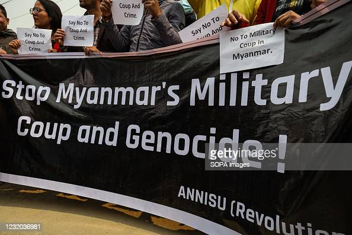
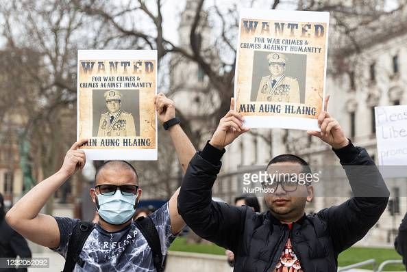

<!--StartFragment-->

Myanmar is widely known for its history of hostility and public clashes between the military and the civilian government. Most recently, the Tatmadaw, Myanmar’s military, declared the results of the democratic general elections of November 2020 invalid and officially transferred control of the nation to the Commander-in-Chief of Defense Services, Min Aung Hlaing\[1]. The ensuing uprising occurred the day before the Parliament of Myanmar was set to welcome the newly elected members, a symbolic move to disavow the results of the elections and solidify the military’s claims regarding the November elections. With the international community watching this political showdown unfold in a small nation in Southeast Asia that led to the massacre of 520 people, including children, many wondered what led the military to take such drastic steps to disrupt Myanmar’s 30 years of hard-won democracy.

Myanmar’s history reveals a tangled mess of a relationship between democracy and the ruling military. In the late 1980s, the citizens of Myanmar grew weary of their government consisting of only one party\[2]. When Aung San Suu Kyi, the daughter of the independence hero Aung San, joined these protests, the movement gained traction and followers. Despite close to 500,000 people marching the streets tirelessly for their freedom, their hope of a better future was crushed on September 18, 1988, when the military declared control of the country. Democratic protests were shut down with brute force, and a myriad of protesters, mostly students, were forced to flee to neighboring countries. A mere year later, Suu Kyi founded the National League for Democracy (NLD) party and won the elections in 1990. In retaliation, the military established the State Council for Law and Order (SLORC) and refused to recognize the authority of the NLD until they agreed upon a constitution. In the next several years, both sides claimed to want democracy but had radically different definitions of it. The military tried to align democracy with their preexisting beliefs of governance and wanted a "disciplined democracy," with full authority stemming from them. Suu Kyi, however, wanted to enforce popular democracy.

Despite the NLD’s protests, the military enforced their vision of democracy for two decades. In 2008, they finally agreed to draft a constitution, which was a main factor in their decision to deny the results of the 1990 election results. However, the adoption of a new constitution was not a win for the NLD as it stipulated that 25% of all seats in Parliament would be under military control. Without the military’s vote, amendments to the constitution would be infeasible. In addition to essentially having veto power, the appointments for ministers for defense, border, and interior affairs were solely dictated by the army chief. In short, a group of high-ranking military generals would have legal jurisdiction over the military and police.

After setting up the constitution to their liking, the military finally acquiesced to hold elections in 2010\[3]. Angered by the blatant bias in the constitution, the NLD boycotted the elections. The military endeavored to endear themselves to the population; in a particularly politically savvy move, they took off their military uniforms and donned civilian clothes to relate to their constituents. With the NLD refusing to participate in the elections, the military won almost all of the seats in Parliament.

In 2015, the NLD seemed to realize that boycotting the elections would lead to nowhere; it would only clear the path to legitimate the military’s rule. With this in mind, the democratic party participated in the elections, regardless of the systematic corruption. Due to their popularity, the NLD won the elections, and Suu Kyi became known as “State Councilor,” holding the same magnitude of power as the prime minister. While the international community hailed this as a victory for democracy and even lifted sanctions, some political experts remained dubious that the NLD even had any legitimate power.

One reason some hold the latter view is that the NLD did not assert their power in 2015. When the military launched operations in the Rakhine state against Rohingya Muslims, the NLD did not make any public statements against this ethnic cleansing. The public especially criticized Suu Kyi on the matter, mainly due to her reputation as a champion for democratic freedom and peace. Her silence gave credibility to the military’s power even when they lost the elections to her party.

In conclusion, the instigation of the 2020 military coup was the military’s determination in reaffirming its totalitarian power over the country. The military imprisoned Suu Kyi because she is a symbol of democracy and hope for the country, despite her failure in the Rohingya Muslims situation. Furthermore, ever since the “democratic” victory of 2015, foreign democratic countries have tried to assist Myanmar’s democratic endeavors. However, they remain largely unsuccessful as states do not have actual leverage to convince Myanmar to continue its democratic pursuits\[4]. The impetus for true democratic change needs to come from the people of Myanmar, who should not be satisfied with a “better”situation than in the 1980s but should want a real, working democracy.

\[1] BBC News

\[2] DW News

\[3] New York Times

\[4] The Guardian

<!--EndFragment-->