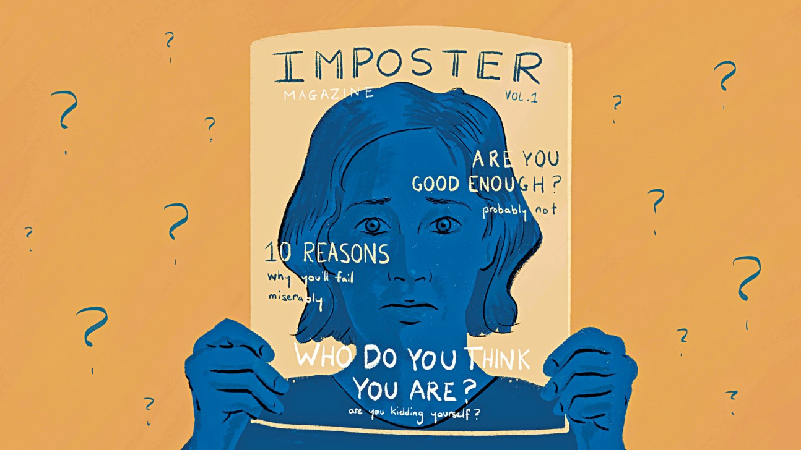

“I got into Yonsei University just because the school administrators mistook my results with someone else”. Never can I forget those thoughts and fears ravaging my mind a few hours after I received Yonsei’s acceptance letter, regardless of my previous study endeavor or the endorsement from teachers and friends. “You are just going through Imposter syndrome. Stop worrying about nonsense things and it will go soon”, my peers said. Yet, during my first year in college, the angst of being exposed as an incapable, imbecile or useless student in this prestigious university never stopped haunting me.

Imposter syndrome is defined as the constant self-doubt of one’s own competency regardless of the evident accomplishments. Under the influence of Imposter syndrome, I only saw my freshman year being wrapped up in 3 words: Anxiety, dissatisfaction and disappointment. While I forced myself to be a well-rounded individual with a perfect transcript and a stunning resume to maintain the competent mask, it didn’t bring me any glimpse of happiness or satisfaction. Failure even felt worse, since it was a revelation of my stupidity and a severe crush to my self-esteem.

The anxiety from imposter syndrome fueled countless of my physical and mental pain during the first year in college. In my uncontrollable pursuit of highest achievements to cover my incompetency, I ignored my inner cry of exhaustion. Lack of sleep, meals skipping, large caffeine intake and stomachache were everyday matters. So were continuous episodes of nonsense worries, mental breakdown, self-degrading words and frantic cry. There are times when I binge ate to “swallow” my stress. Despite the struggle I had been through, any type of achievement could not satisfy me, and even small failure could push me in the hole of desperation. I can still remember a time when I stayed up for 67 hours straight to polish a major class’s assignment, since I didn’t feel happy with my “above average” performance. I was suffering from a terrible stomachache, my heart was racing, my hands were shaking, and when I came to class, I could not walk up the stairs properly without leaning on the handrails. Yet, all I received for those stressful 67 hours was a feedback that I did too much unnecessary and ineffective work. That was the first time and the only time I broke into tears in class, since I felt so embarrassed and devastated. When imagining how incompetent I was in my peers and professor’s eyes at that moment, I felt sick of my own existence in that class. Then, the torturous anxiety recurred: “Whatever I tried, everybody in this school still sees me as a useless imbecile. Everybody knows I’m not supposed to be here”. I was so scared of the course that every time the class time came, my anxiety made me feel nauseous. I ended up withdrawing the course, and even till now, after 2.5 years, the experience is still traumatizing for me to think about.

If one expects to see some dramatic change in my awareness or some miraculous improvement in my imposter syndrome coping mechanism here, there is none of it. Honestly, I can never fully recover from its traumatizing effects. However, as time passed by, I gradually learned to not suffer from it alone. Unlike the freshman me who tried to confront everything on my own, I now share my thoughts and fears with my close friends, who will listen, remain silent and give me warm hugs. For me, silence and loving hugs are the best healers to calm the chaos in my mind. I also spent more time with my dog, who radiates with positive energy all the time. Raising a dog and seeing him being so excited for such simple things like getting some treats, enjoying a good belly rub, or finding out his long-lost squeaky toys, I actually learn from him to live the moment and be happy about little things around me. However, a harder thing for me to learn is to embrace myself as a competent and deserving student in Yonsei University. Till now, I still question myself all the time: “Am I deserve to be here? Am I good enough? What if I fail?”. Yet, my anxiety did relieve when I gave advice to the newcomers and saw how far I improved from the original me. While it does not totally eliminate self-doubt, I clearly enjoy a glimpse of happiness when seeing myself getting much better and stronger than freshman me, which I cannot achieve even when getting an all A transcript.

To heal oneself from imposter syndrome’s effects, apart from self-care, it is beneficial to seek help from the professionals. An easy access to mental healthcare professionals is Yonsei International Campus Counseling Center, providing psychological counselling for all Yonsei students. More information about the center can be found [here.](https://www.yonsei.ac.kr/en_sc/campus/welfare6.jsp) Lastly, It is not at all embarrassing to suffer from mental issues or being unable to cope with it all by oneself, and it is courageous to seek help for one’s mental problem.

After all, I decided to retake the course that I found traumatizing 2.5 years ago in the next semester. I’m not sure if I can totally overcome that trauma of being seen as the incompetent individual in that class. Yet, this time, I’m ready to face that fear again and challenge my improvements.