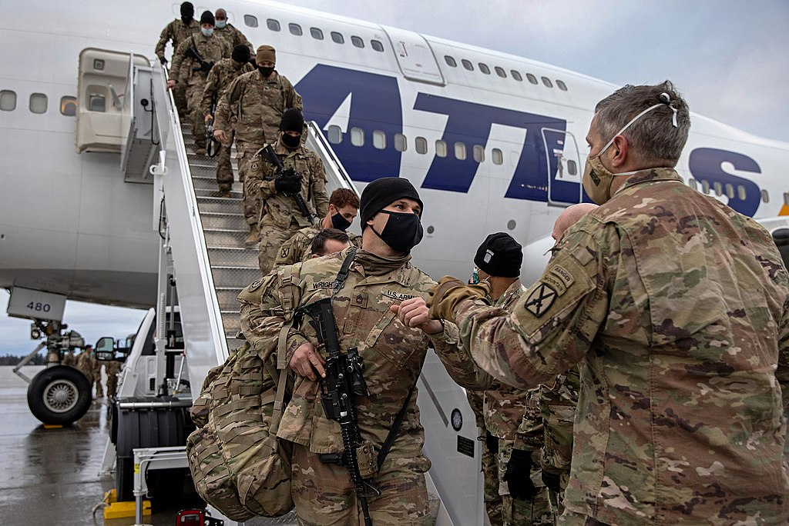

The longest war in US history terminated on 30 August with the total withdrawal of the US military from Afghanistan lands. It began in 2001 in the context of the September 11 attacks when the Taliban refused to extradite the al-Qaeda leader Osama bin Laden. US and NATO troops have been stationed in Afghanistan to achieve a politically controversial, rather unclear goal that oscillated between the prevention of terrorism and state building since.

President Trump signed the Doha Agreement—a peace agreement to end the War—with Taliban in February 2020, which stated that foreign troops would be withdrawn under the conditions that Afghanistan is not used as an al-Qaeda breeding ground and that Taliban engage in diplomatic talks with the Afghanistan government. President Biden concluded the foreign policy trajectory Trump laid out, firmly claiming that it was a good decision.

**US Reasons’ for the Withdrawal**

There were various reasons for the US decision to withdraw all troops. One is the immense costs: the US has spent $2.3 trillion and lost the lives of 2400 US service members. Such costs significantly impacted domestic politics. The US public opinion thus geared towards the opinion that such money, technology, and lives could be invested in an initiative that would directly benefit American citizens. Progressives have strayed away from the desire to promote human rights in Afghanistan and instead highlighted the importance of rebuilding America. Conservatives are less committed to President Bush’s freedom agenda and instead hope to put “America First”. Biden also included the withdrawal from Afghanistan in his presidential campaign: he had to abide by this popular agenda once his presidency began.

Moreover, America did not want to have another Vietnam where a losing war continued indefinitely: a respectful exit appeared to be the wise choice. The Taliban has grown extensively compared to the initial stages of the war. It self-suffices with its own economy; its weaponry has developed. It has also manifested strong confidence and determination to gain control over Afghanistan. Two decades of American effort have failed to sustain and reinforce the existence of a democratic government in Afghanistan. Thus, it appeared wise to negotiate with Taliban, encouraging talks between Taliban and the Afghan government and ensuring that Afghanistan land is not used for terrorist attacks against the US, rather than extending the unending war.

The focus of American foreign policy has also diverted from its goals in 2001. Before, they’ve considered Central Asia a region of significant strategic interest; now, they are more focused on advancing their interests in the Asia Pacific. They are also more invested in engaging in the rivalry with China and Russia.

**Implications of the Withdrawal on the US and International Society**

For Afghanistan, the American decision had tragic consequences. Following the Taliban takeover of Afghanistan and the final withdrawal of US troops, two bombing incidents occurred on August 26th in the vicinity of the Kabul airport claiming the lives of thirteen US troops and dozens of Afghanistan citizens. Moreover, due to the radical fundamentalist tendencies of the Taliban, there have been abundant reports on human rights violations especially on women and children. Such aggression paints daunting prospects for the future of Afghanistan.

America has also suggested that such a turn in foreign policy will allow a more effective confrontation towards and undermining of rivals (Shear and Tankersley). They will invest more in economic and cybersecurity facets in the rivalry with China and Russia and use technological methods instead of troop deployment in confronting terrorists. However, the decision to withdraw may actually empower rivals. China and Russia may attempt to increase their sphere of influence in Afghanistan, and despite Taliban’s current promises, Afghanistan could be used as a terrorist breeding ground.

American foreign policy is projected to be less hawkish and Wilsonian: they will be less determined to state building in foreign countries. Instead, they will strive to implement policies with “clear achievable goals” that align directly with national security interests as proclaimed by Biden on August 31st. (Shear and Tankersley). Although this may be viewed positively in that America is not supporting a corrupt government, it is likely to degrade America’s reputation as the safe-keeper of international democracy.

Moreover, such policy change has a potential to ignite distrust within US allies. For instance, while South Korea is currently a US ally, there are fears that one day, the US may decide to “give up” on South Korea like it did to Afghanistan.

While opinions on the American withdrawal from Afghanistan are diverse, it is undoubtedly a significant turning point in international history. We are now beyond the post-9/11 international society: a new world order is impending.

**Citations**

Image credit: CrusaderToonamiUK

“Afghan Conflict: US and Taliban Sign Deal to End 18-Year War.” BBC News, BBC, 29 Feb. 2020, www.bbc.com/news/world-asia-51689443.

Mazzetti, Mark. “Biden Declared the War over. but Wars Go on.” The New York Times, The New York Times, 22 Sept. 2021, [www.nytimes.com/2021/09/22/us/politics/biden-war.html](http://www.nytimes.com/2021/09/22/us/politics/biden-war.html).

Shear, Michael and Tankersley, Jim. “Biden Defends Afghan Pullout and Declares an End to Nation-Building.” The New York Times, The New York Times, 1 Sept. 2021, www.nytimes.com/2021/08/31/us/politics/biden-defends-afghanistan-withdrawal.html.

Trofimov, Yaroslav, and Dion Nissenbaum. “Who Are the Taliban and What's next for Afghanistan?” The Wall Street Journal, Dow Jones & Company, 27 Sept. 2021, www.wsj.com/articles/who-are-the-taliban-11628629642.

“What Is the Doha Agreement Signed by the Taliban?” The Independent, Independent Digital News and Media, 19 Aug. 2021, www.independent.co.uk/asia/south-asia/doha-agreement-afghanistan-taliban-deal-b1905371.html.

Zucchino, David. “The U.S. War in Afghanistan: How It Started, and How It Ended.” The New York Times, The New York Times, 22 Apr. 2021, www.nytimes.com/article/afghanistan-war-us.html.