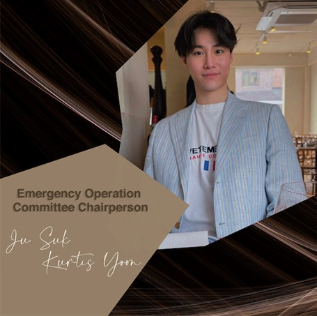

<!--StartFragment-->

Behind the scenes of the bustling student life at Yonsei University is a team of passionate fellow students who dedicate their time to organizing various activities. One of these students is Yoon Ju Suk, the current chair of the Emergency Operation Committee (EOC) for the Political Science and International Relations (PSIR) major at the Underwood International College. For the past year and a half, Yoon has operated as the chair of the PSIR EOC and is concluding his term this August due to his obligation to the Korean military service. UIC Scribe had an opportunity to sit down with Yoon in order to discuss his time serving in Yonsei’s student government as well as the lessons he has learned along the way.

To begin, Yoon briefly explained the role of the Emergency Operations Committee.

> **Yoon**: The EOC seeks to provide the minimum administrative services for the PSIR community. We automatically transition into the EOC state if the official PSIR cabinet is vacant. The primary role of the EOC is to maintain the status quo or simply put, continue what the previous council was doing. These basic activities include creating the Kakao group chat for PSIR and relaying important messages between the UIC office, major professors, and the PSIR student body.
>
>

The COVID-19 pandemic has greatly impacted student life, and Yoon delved into how exactly the roles and responsibilities of student government were altered as a result of the pandemic.

> **Yoon**: COVID really affects everyone and every part of our daily lives, and naturally, student government has transformed to adapt to the current situations. When the pandemic first hit, it was very troubling for everyone in student governments, and we started panicking because there was no written rulebook on dealing with such foreign conditions. Everything we had prepared had to go digital, including the major information sessions, the meetings with chairs, and the welcome activities for freshmen. We are still figuring out a way to better serve the freshmen class and make them feel like part of a bigger community. Providing freshmen with a sense of belonging when they have just entered such a new environment has always been difficult, and the pandemic rendered it even more challenging.

This sense of community is what Yoon aims to solidify with the new EOC recruits.

> **Yoon**: Because I am going to the army soon, there will be a vacancy from August to December, and the EOC plays an especially critical role in September in welcoming new PSIR members. No one ran in the March re-election for the student council, so it was imperative for this vacancy to be filled. I think the greatest strength of the new recruits is the enthusiasm they have for serving their community. Compared to other majors, PSIR seems to lack this sense of community and that is reflected in how every year the number of students in PSIR has been diminishing. The new recruits have this passion for solidifying this sense of community and PSIR identity, and I am confident that they will work hard to see the community flourish. Furthermore, the recruits are all from a diverse array of places, and this diversity in their backgrounds translates for a perspective that prioritizes inclusivity. They deeply understand the importance of creating an environment of acceptance for such a diverse student body.
>
>

Concerning the future plans for the EOC, Yoon elaborated on the new endeavors for the PSIR community.

> **Yoon**: We are preparing a number of programs and events that I think will help the class of 20 and 21 feel a greater sense of belonging to a larger community. The PSIR varsity jackets are being organized for the first time since 2018, and this is important to provide the same sense of inclusion. We are also accepting new designs from the student body and the person with the most popular design will win a free jacket. Also, we are organizing a program that matches upperclassmen with underclassmen. Hopefully, by grouping these new PSIR students with their upperclassmen, new relationships could be fostered, and seniors could give advice and befriend their underclassmen.
>
>

When asked about any last advice he could give to those interested in student government, Yoon stressed the necessity of fighting apathy and encouraging student participation.

>
>
> **Yoon**: The biggest advice I can give is for people to stop viewing student government as this complicated and scary thing but instead participate in any way that they can. You do not have to run for office in order to be part of student government: show up to events, ask questions, and demand the changes you would like to see. Student government can only work if there are students, and it can only succeed if these students participate.

<!--EndFragment-->