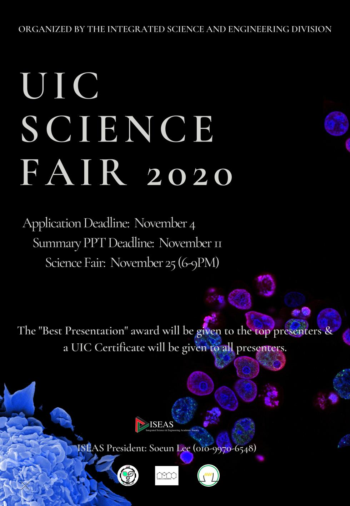

“With the interdisciplinary approach in engineering and natural science, this science fair would contribute further to the development of Integrated Science and Engineering Division and I hope that students will bear out a fruitful outcome.” Professor Taeyoon Sung (Dean of UIC) made a welcoming remark that opened the UIC Science Fair 2020.

In the evening of November 25th, the UIC Science Fair 2020 was held online successfully for three hours, organized jointly by the Integrated Science and Engineering Division (ISED) and the Integrated Science and Engineering Academic Society (ISEAS). Due to the current COVID-19 situation, the fair was held on Zoom with participants, professors and audience. There were six professors who served as judges, including Sang-Yup Lee (Director of ISED), Jonghak Kim (Chair of Energy and Environmental Science and Engineering), Milan Balaz (Chair of Bio-Convergence), Jiwon Kim (Chair of Nano Science and Engineering), Sunglan Chung (Integrated Science Engineering Division), and Rajkumar Patel (Integrated Science Engineering Division).

Ten participants had been selected for their real-time presentations and eleven participants had their recorded presentations. Below is the list of the ten researches presented at the fair.

**The Design of Highly Sensitive and Selective Virus-Based Electric Nose towards Explosives**

JungYun Park (BC ‘15)

**Unexpectedly High Thermoelectric Properties of Hexagonal SiGe**

Sung Jun Hong (NSE ‘15)

**Dynamic Functional Connectivity in the Brain: State Transitions in Youth with ADHD**

Sungmin Park (BC ‘15)

**Two-Dimensional ZIF-8/6FDA-DAM Mixed Matrix Membranes for Propylene/Propane Separation**

Minsu Kim (EESE ‘15)

**Exosome-liposome hybrid, a potential carrier for drug delivery across blood brain barrier**

Haebin Kim (BC ‘17)

**Recent advancement in composite membrane separator for application in Lithium-Sulfur batteries**

Seokhyeon Oh (NSE ‘17)

**CSF1R inhibitor screening as a preventive drug for Alzheimer’s disease**

Jisu Park (BC ‘17)

**Automated Y-maze Testing for Spatial Working Memory Test**

Seoyeon Park (BC ‘18)

**Solid Oxide Fuel Cell-Gas Turbine (SOFC-GT) Hybrid System**

Jiyong Lee (EESE ‘15)

**Noncanonical Head-to-Head Hairpin DNA Dimerization is Essential for the Synthesis of Orange Emissive Silver Nanoclusters**

Sooyeon Park (UD LSBT ‘17)

At the end of the fair, professor Jiwon Kim announced the four Best Presentation Awards. Recipients who received the most votes from the judges, in no particular order—Haebin Kim, Sungjun Hong, Jiyong Lee and Sooyeon Park. Regardless of the award, this science fair had clearly shown how students had put in a lot of effort and passion into their fields of interest.

Our official UIC website introduces ISED as follows, “Students gain a solid understanding of the ways in which science and technology affect our society, politics, and economy.” This statement could be clearly seen in this year’s science fair with every presentation having their own motivation, such as the drive to enhance some parts that are inconvenient or that should be changed in our lives. For instance, Sung Jun Hong started his research by exploring “How can we produce electricity from waste heat, instead of using fossil fuels?” For Seokhyeon Oh, he saw that as time passed his fully-charged smartphone battery (Lithium-Ion) duration time began declining. Therefore he chose to work on a Lithium-Sulfur battery and see how it worked. Not only are they delving into scientific studies but they also have generated new knowledge that can be applicable to other social sectors.

As for the online fair atmosphere, we can’t say it was exactly the same as the previous offline fairs that had been held in Songdo. It was rather a calm academic conference more than a heated onsite fair. We could not feel the lively atmosphere, with no sound of applause or cheerings for the participants. They could not provide wide arrangement of food and beverages for the audience, nor photogenic photobooth afterwards of course. Yet without all these, almost 70 people joined Zoom to watch. This definitely shows UIC students’ passion in hearing about intensive academic research and getting to know about the perspectives of other students. Although there were less thrills and surprises than that of an onsite fair, the heat of the academic passion was for sure hot, with professors and audience asking critical questions in each Q&A session.

UIC Science Fair is usually held at the end of every November, and the information is announced at the UIC official website under ‘Announcements.’ It is open to all UIC students. If you are interested, go for it and it will be a great opportunity for you to proudly present your rigorous research in front of your peers!