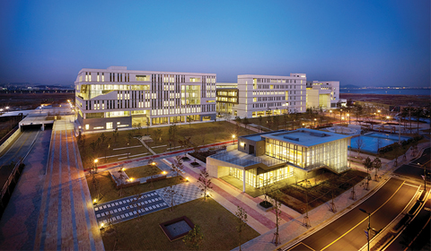

Starting next semester, Underwood International College (UIC) will take a step further into interdisciplinary education by offering the Master of Science (MS) in Innovation curriculum. MS in Innovation is UIC’s first graduate school program, but also the first higher education program in Korea on innovation that is taught in English. The program offers courses for specializations in Social Innovation, Design Innovation and Technological Innovation. It seeks to integrate key concepts and approaches from novel fields of academics and generates an understanding of the issues from both theoretical and practical perspectives.

UIC launched the program to answer the demand for workforces in rapidly changing communities to combat unprecedented problems. Globalization and the digital transformation of industries produced new social agendas that can no longer be addressed with existing disciplines. Therefore, the program aspires to provide societies with researchers who are able to approach challenges with an interdisciplinary perspective. This means that the curriculum will not only entail commitments for one’s own profession, but also comprise a fusion with other disciplines. All the while, the program will play the role of an innovation research institute, to keep up with the demand for Korea’s innovative presence at a global level.

To achieve such visions, the Master’s program will provide students with various resources. First, the program is to be led by renowned faculty members of each majors of the Humanities Arts, and Social Sciences Field (HASSF) of UIC. They are not only researchers and educators, but also practitioners, prepared to give practical insights to the students. Second, the program will be utilizing highly regarded education infrastructures to a great extent, such as the Design Factory Korea (DFK), the Yonsei Makerspace and the Yonsei Social Innovative Center, all providing learning platforms for innovations in design, technology, business and society. Third, core classes will equip students with problem-solving skills and capabilities for systems thinking, design thinking and computational thinking. Finally, students will be offered opportunities to participate in research projects to implement their knowledge.

“We expect students to drive innovations that will tackle wicked problems in various segments of society, such as vulnerable and underserved populations, companies that seek sustainability of their supply chain partners, etc.,” says Semee Yoon, Assistant Professor of Sustainable Development and Cooperation at UIC. “We are looking for students who are interested in acquiring a good working knowledge of technical skills required for digital transformation and pursue interdisciplinary research to grasp the complexity of multifaceted challenges, which require creative solutions.”

Students can earn the degree by completing several core courses and numerous elective courses, which can be selected within or outside of the program curriculum. This means that the students will have the opportunity to experience subjects outside their major, including courses from the Sinchon general graduate school programs. In fact, students are encouraged to pursue coursework that encompasses diverse fields offered at Yonsei.

Graduates of the Masters program are expected to find careers in both research and field works. Opportunities for graduates span across diverse fields requiring experts with hands-on problem-solving experience. Thus, the program is recommended for those who are passionate about changing the status quo, and want to construct solutions to the most prominent social agendas of our time.

To the prospective students of the UIC graduate school, “ the year 2020 has been a tough year but the COVID-19 crisis has accelerated digital adoption and diffusion at varying rates,” comments Yoon. “How we reconstruct the social fabric in the post COVID-19 era will depend on creative minds coming together with good intentions. If you are seeking to dig deeper into questions that remain unanswered during your undergraduate studies, we look forward to working with you on those questions in a safe, multicultural and interdisciplinary environment.”

To find out specific curriculum and check for admission dates, visit [here.](<[https://uic.yonsei.ac.kr/ main/major.asp?mid=m02_07_01](https://uic.yonsei.ac.kr/main/major.asp?mid=m02_07_01)>)