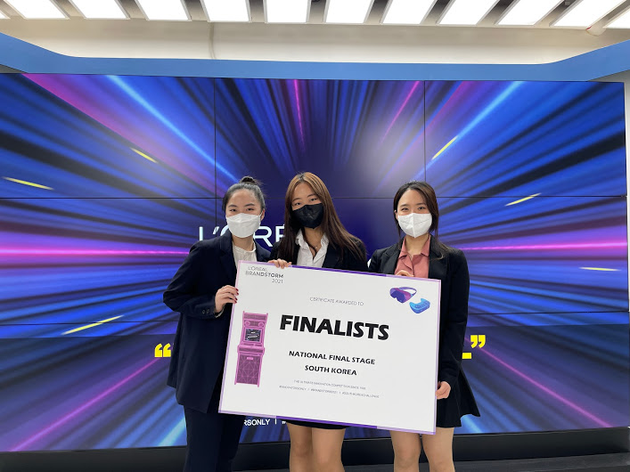

<!--StartFragment-->

A college student’s job is to study course material and to earn a college degree. However, there are hobbies and activities outside of studying that they spend hours working on. One common extra curricular activity popular among Korean university students is to enter competitions that give them an opportunity to apply the skills and knowledge they have learned in class. This semester, I, a student at Yonsei University, will share my experience taking part in one such event known as the L’Oreal Brandstorm.

This particular competition is one of thousands that students can participate in as a way to challenge themselves, gain experience for future job prospects, while also having the chance to win a prize at the end. Underwood International Students may take advantage of the many events that happen each year, whether they are an international or Korean student. An easy way to search for competitions is checking the Yonsei University career development website.

The competition that I participated in has a longer history than most, as it started in 1993 and gradually gained popularity with around 48,000 participants from 65 countries in 2020. It’s mission is not only to provide a learning opportunity for all students about technology within the cosmetic industry or business marketing, but also for highly qualified students to learn about the career opportunities they provide.

Our team started working on the project mid-February. This year’s prompt was “invent\[ing] the beauty shopping experience through entertainment”. We created a reality show that showcases looks using L’Oreal products because reality shows are popular worldwide, making it not only approachable for the consumers but also globally lucrative for the company. For the national-semi finals, we had to prepare a lot more than a one-minute video we screen-recorded on zoom in the previous round. Our team got very close as we met up often offline, giving us another memory to cherish as we grew older. On the day of our presentation, we were quite nervous because we were filming at a professional studio. Even though we did make a few mistakes, we luckily got through to the national finals which is where we ended our journey as the runner-up team. L’Oreal Korea offered us a two-month internship as a prize, as well as a goodie bag full of their products.

How can one do well in these competitions? Always, always, think about the main reason why the competition is being hosted. For example, is it to gain new marketing ideas that the hosts can use in their actual business ventures? If so, do your research on potential customers and trends. L’Oreal Brandstorm was looking mainly for a business idea that they can use in real life. The prize for first place was to bring the proposed project into fruition over a period of six months in their innovation hub. That means they want a project that is fully viable and instantly ready to go within six months. It also has to be innovative enough to be deemed an “innovation project”.

But don’t forget to look at other secondary reasons for the competitions as well. L’Oreal was offering internships as a prize, meaning they must be looking for people that have the potential to work in an office environment. We made sure that our presentations were also in an office-friendly format, demonstrating our potential to do well as an intern. More specifically, we tried to imitate the logic of professional marketers, such as introducing the target consumers and their habits. Then, we presented our idea, making sure to be very specific, such as using the actual names of viable business partners and explaining why the idea is realistic. Finally, we provided financial projections. One comment we got from the judges in the national finals was to never use words that imply these numbers are projections, but to use language that states you are completely sure that these will be the exact results of your project.

Here are some more general words of advice for those that are looking to participate in similar events. First and foremost, do not forget that this is an extracurricular activity that is not going to influence your life dramatically! Put some effort and time into the project, but it should not have more importance than a healthy lifestyle and your responsibilities as a student. It also means that it is not the end of the world if the results are not what you expect. It is important to be appreciative of the opportunities you have! Second, make sure you express your thoughts and concerns to your teammates, if you have any. Nobody is perfect, and good-ideas can come from anywhere! Whatever concerns you have are probably shared by your teammates too; they just do not broach them because they are not sure themselves that their concerns are legitimate.

A competition like this can be an opportunity to win prizes of all sorts, gain experience that will propel you to improve, or create unforgettable memories! If you have the time and energy, or you are looking for a new challenge for yourself, why not give it a try?

<!--EndFragment-->