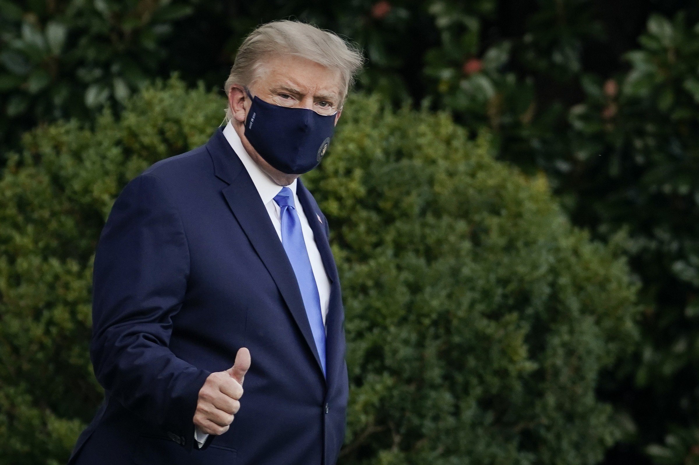

COVID-19 has fundementally changed how we live. As of 19 Oct. 2020 over 1.1 million people have died from Coronavirus and millions more have been infected. Presidents and prime ministers have not been spared. Boris Johnson, Jair Bolsonaro, and even Prince Charles were all diagnosed with the disease, and most recently, the news of Donald Trump testing positive has sent shockwaves across the world. With only weeks before the presidential elections in the United States, all the public could do was speculate about Trump’s health based on his constant, vigorous updates on Twitter. News media outlets around the globe speculated as to what would happen if America’s head of state were to become too ill to carry out presidential duties. Contrary to many pessimistic predictions, however, President Trump has reportedly recovered from the disease and returned to the campaign trail. This article covers the experiences of other world leaders who have tested positive for COVID-19. By doing so, we can gain new insights into the future of American politics.

### Boris Johnson

The Prime Minister of the United Kingdom, 56, tested positive for COVID-19 in late March, during the early stages of the pandemic. As he entered intensive care on April 7, he deputized Foreign Secretary Dominic Raab; however, he never formally transferred power. After receiving oxygen treatments, he was released and returned to work in late April. Following his recovery, his tone became noticeably more cautious than before. He had initially insisted that Britain would not adopt strict lockdown measures, but changed his stance and eventually issued public health related restrictions such as closing schools.

### Jair Bolsonaro

The Brazilian president, 65, tested positive in July. President Bolsonaro’s response to the pandemic was very similar to Trump’s; he called the virus a “little flu” or a “measly cold” and constantly downplayed its severity. He attended political rallies without wearing a mask, and encouraged others to gather in large crowds. Like Trump, he has praised hydroxychloroquine, a treatment for malaria that has been proven to be ineffective against coronavirus. Bolsonaro experienced aches and had a fever, but his conditions were fairly mild. His quick recovery assured his supporters that the virus was not too serious.

### Nikol Pashinyan

Armenia’s Prime Minister Nikol Pashinyan, 45, tested positive in late May. The prime minister, his wife, and his four children all contracted the virus. According to him, he was infected by a waiter who served him water during a meeting. However, he did not show any noticeable symptoms and continued to carry out his duties by working from home. A week later after being diagnosed with coronavirus, he recovered and tested negative.

### Prince Albert II of Monaco

The first world leader to publicly announce being infected by COVID-19 was Prince Albert of Monaco. He tested positive in March, three days after Serge Telle, the city-state’s prime minister, also came down with the disease. Prince Albert, currently 62-years-old, continued to work from his office and announced his recovery in early April. The sovereign prince was declared “cured and in good health,” according to the Palace of Monaco.

### Alexander Lukashenko

Belarus’ authoritarian leader said in July that he had experienced an asymptomatic case of coronavirus. He contracted the disease ahead of the presidential election in August, which was largely criticized for being rigged in his favor. President Lukashenko has refused to issue a lockdown and has dismissed the threat the virus poses. He has previously suggested that citizens should “drink vodka” and make “regular visits to the sauna” to stay healthy.

### What will happen now to Trump?

Every world leader who has contracted the virus thus far has recovered and returned to their duties. Trump’s recovery has been especially quick. Nine days after testing positive for coronavirus, getting hospitalized, and being treated with experimental drugs, Mr. Trump tweeted on October 5 that he feels “better than \[he] did 20 years ago!” He gave a double thumbs-up as he entered the White House after being discharged from Walter Reed National Military Medical Center.

However, there have been numerous cases of “recovered patients” experiencing recurring symptoms. In addition to this, Trump is older than most of the other world leaders covered in this article. Even the president’s physician, Sean Conley, said that Trump “may not be out of the woods yet.” Although the president is back in the White House, we cannot be too sure that the Oval Office will remain infection-free.