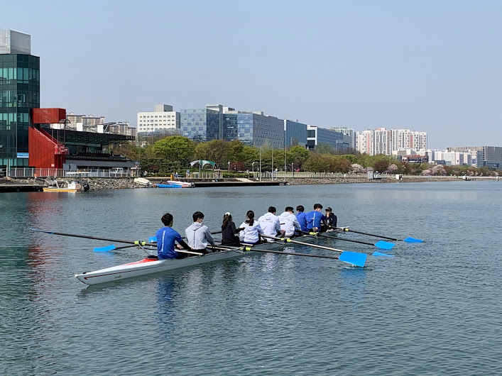

<!--StartFragment-->

Trying new things is a large part of the college experience for many. The wide variety of student clubs and organizations that Yonsei University has to offer allows students to try out many different things. One unique club at Yonsei is the Yonsei Rowing Team, one of 8 university rowing teams in Korea. The Yonsei Rowing Team has been around since 1961, a year many other universities founded rowing crews as part of the aftermath of the May 16th military coup d'etat led by Park Chung-hee. The goal was to promote a strong and healthy body as well as mind. However, some members of the public criticized the move as being part of the dictator’s grand scheme for staying in power.

Nevertheless, the Yonsei Rowing Team has thrived with new members joining constantly for the past half-century. The Yonsei Rowing Team is supported financially in large part by an extensive alumni network. Thus, they are able to continue training new students who may not have the means to participate in such an otherwise expensive sport. On weekdays, the team uses ergometers located on the Sinchon campus to build endurance. They will also do some intense circuit training or even go on a run by the Han River if the weather is nice. On weekends, they travel to the Misari Regatta located just to the east of Seoul and actually train on the water. All this training leads up to the University Rowing Club Race, an annual competition that involves seven other universities in Korea. The other universities include Seoul National University, Korea University, and Hankuk University of Foreign Studies. The competition takes place during summer break. Before it, the team prepares for the competition at a special summer training camp in Chung-ju. They not only train all day together, but also use the same living quarters so they can truly learn to work as a team. Teamwork is considered to be especially important in rowing.

Since 2020 the team has had to make some changes to this intense routine due to the COVID-19 pandemic. Training came to a halt until the pandemic was brought under control and even then they could no longer use school facilities. They had to train in the corridors of the school’s sports building. In 2021 the team decided to rent a studio near the school so that they could train more efficiently.

Many on the team were disappointed when news broke that the Annual University Rowing Race was cancelled in 2020. However, the 2021 season is back in full swing. The annual regatta is back on track, and the Yonsei Rowing Team has been preparing accordingly. Despite this, some setbacks still remain. The team is unable to train in Chung-ju as normal. Instead, the team is planning to stay near Misari Regatta for a five week training session.

Some wonder how the rowing team is able to train despite the national four person limit on gatherings. The rule is only applicable to private meetings however. More than four people are allowed to meet up if they’re training for a competition, taking a class, or partaking in a collective artistic activity. This is why the rowing team was able to keep training. In fact, the school football team, swimming club, basketball club, dance teams, and the like are still able to meet up to train. If sports is your cup of tea, you can also try filmmaking clubs, the theater club, and many more. All of these clubs continue to function, while making sure to abide by COVID restrictions. The resilience shown by the rowing team and other student organizations is truly inspiring.

<!--EndFragment-->