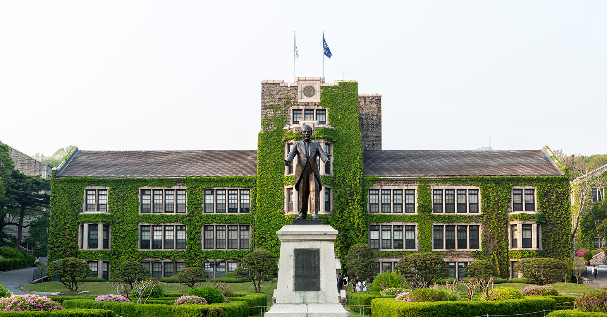

On October 28th, the General Student Council announced Yonsei University’s decision regarding tuition refund for the 2020 spring semester. Following suit of many universities in Korea, Yonsei University has responded to the demands for a tuition refund due to the COVID-19 pandemic causing abrupt changes in the learning environment.

The negotiation process began on September 21st with forming a subcomittee to discuss matters regarding the 2020 spring semester tuition refund under the Yonsei Tuition Deliberation Committee. This subcommittee was created to focus on discussing tuition refund matters with the Office of Student Affairs and Services. Starting September 28th, there were a total of 4 meetings on October 8th, October 16th, and October 28th. The subcommittee, constituted of 6 members, was joined by the student representative of the College of Social Sciences and the student representative of the Global Leaders College in these meetings.

The tuition refund decision is divided into two main parts: Special Scholarship for the 2020 Spring semester and COVID-19 Need-based Scholarship. The Special Scholarship for the 2020 Spring semester applies to all students who have attended the 2020 Spring semester. This scholarship subsidizes costs generated from a shift to an online education setting due to COVID-19. All students who attend the spring semester will receive 100,000 KRW as basic subsidies, while students who registered for lab courses will receive an additional refund for unexecuted experimental fees. The amount of unexecuted experimental fee refunds will differ respectively by the tuition the student has originally paid. As a result, the Special Scholarship for the 2020 Spring semester plans to give students a minimum of 100,000 KRW to a maximum of 300,000 KRW refund for their compromised education the previous semester. For students enrolled in their 9th semester and beyond or students who took a leave of absence mid-semester, their refund amount will be decided in proportion to the tuition they initially paid. Students can receive the Special Scholarship in either cash or co-op certificates, and a third option of donating is also available. The time of payment is expected to be late December, as the school stated that it would take time to calculate the unexecuted experimental fees specifically for all majors.

The second scholarship announced by the General Student Council is the COVID-19 Need-based Scholarship. Yonsei University has decided to expand its budget by 500,000,000 KRW to provide scholarships to students who are facing economic hardships due to COVID-19. Being a need-based scholarship, the school will select 500 students who fit their criteria (specific standards have not yet been announced) and provide a scholarship of 1,000,000 KRW to each student. Yonsei University also stated that it is planning to continue providing this scholarship to students every semester until the COVID-19 pandemic comes to an end. In addition to these matters, the subcommittee also discussed whether there is to be an additional refund regarding budgets for programs that could not be executed due to COVID-19. To this, the school responded that although making calculations mid-year would be unrealistic because a yearly budget is already fixed, they would not evade any discussion regarding this matter after the end of the year.

Yonsei University’s participation in the tuition refund movement was a slow decision compared to other universities. As of August 2nd, over 40% of universities in Korea had already agreed to provide partial tuition fee refunds to both their domestic and international students. Furthermore, the refund that all students are eligible for (basic subsidies) is applied at a flat rate and does not take into consideration the differing tuitions across different majors. As opposed to Yonsei University’s decision, many universities—including Seoul National University, Kyounghee University, and Konkuk University—are giving tuition refunds in proportion to the different tuition students pay, ensuring that students receive the same degree of benefits.

Despite the shortcomings of the most recent decision, Yonsei University has finally started making decisions to protect the educational rights of students. From the highly limited remote learning subsidies provided through the Yonsei Co-op to the protests regarding educational rights and now a tuition refund, the school is making progress. At a time harder than ever to receive education in a stable setting, Yonsei University should continue on this path, taking a more active stance and being more communicative with students to find better ways to maximize its resources and ultimately protect the educational rights of students.