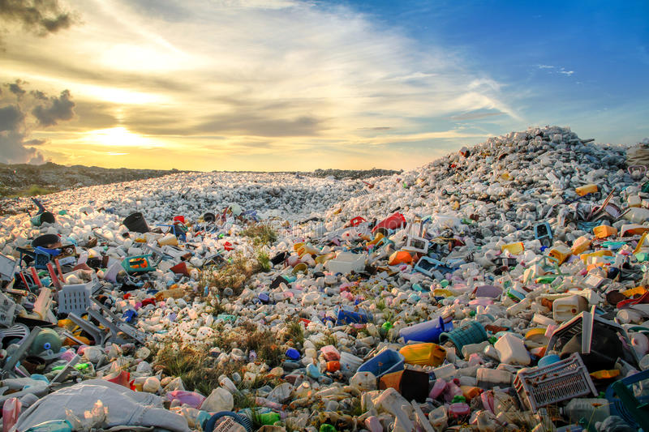

<!--StartFragment-->

Coca-Cola has always been iconic when it comes to packaging, ever since the introduction of curvy contour glass bottles in the early 1900s. Yet now, Coca-Cola is trying to add another — even more iconic — feature to its packaging: paper bottles. Coca-Cola Europe launched a trial of paper-based bottles in Hungary last February, distributing 2,000 bottles of plant-based beverage Adez in an online grocery retailer. Along with the development of eco-friendly bottles, the company is aiming to collect and recycle every can or bottle it sells by 2030.

The move by the soft drink giant is linked with a bigger environmental movement dubbed ‘zero-waste.’ Zero-waste, according to the Zero Waste International Alliance (ZWIA), stands for “the conservation of all resources through responsible production, consumption, reuse, and recovery of products, packaging, and materials without burning and with no discharges that threaten the environment or human health.” The zero-waste lifestyle aims to minimize the amount of trash through constant reuse and recycling.

While the concept of zero-waste is not new, it is now receiving more public attention than ever before. Ever since the outbreak of COVID-19, the usage of delivery services in South Korea skyrocketed. According to Statistics Korea, the transactions in the food delivery service sector amounted to 17.4 trillion KRW last year, a 78.6% increase from the previous year. Increased use of delivery services meant more waste; the Ministry of Environment confirmed that the amount of plastic waste has grown by more than 18% in the same time frame. Concerns surrounding plastic waste have been rising accordingly. According to a survey conducted by Incruit in March, 57.5% of the 5,155 respondents said that they are aware of the seriousness of waste problems caused by food delivery. In addition to this, more than 60% of the participants responded that they are trying to reduce waste in their daily lives.

Given this, it may not come as a surprise that a growing number of people are taking part in zero-waste campaigns. The zero-waste lifestyle is known to have multiple benefits. Not only does zero-waste lessen land and marine pollution, but it can also help reduce greenhouse gas (GHG) emissions. According to research by the University of California, Santa Barbara, GHG emissions from plastic took up 3.8% of all greenhouse gas emissions in 2015. However, if excessive plastic production continues, this number could reach 15% by 2050. Therefore, reducing plastic usage can reduce carbon emissions in the long term, thereby lessening its impact on the climate. The South Korean government has been stressing the importance of plastic recycling as well. In February, the Ministry of Environment issued a pre-announcement of legislation of the Act on recycling and reducing plastic consumption. Apart from environmental benefits, zero-waste followers point out personal advantages of zero-waste lifestyles. Bae Hye-Lim, 24, a “newbie” who has been trying zero-waste for two months, said it had a positive effect on her emotional well-being. “Well, zero-waste gives me the feeling that I have achieved something, something good,” she said.

Keeping an entirely trash-free lifestyle, however, definitely has its hardships. Currently there are less than 100 zero-waste shops and refill stations in South Korea. This makes it hard for beginners to apply zero-waste principles in their daily lives, as most of the groceries in supermarkets are already wrapped in plastic. Although the total number of eco-friendly markets are increasing, there is still a long way to go. A university student commented that having a zero-waste lifestyle was “nearly impossible to be honest,” especially “if you are living in South Korea where everyone — including myself — is so used to delivery and plastic wrappings.”

Experts say there are easier ways for zero-waste beginners to reduce waste in their daily lives. Jung Hye-Mi, 31, a mother who runs a social media account on the zero-waste lifestyle, shared her experiences in an interview with the UIC Scribe. “Ever since I decided to live a zero-waste life, I used my own container all the time when I visited markets or restaurants,” she said. “It was especially hard for me to ask bigger franchise restaurants and markets to wrap up food in the containers that I have brought from home.” To save time and energy, she began to call the restaurants beforehand to check whether it would be okay for her to use her own containers. She has also been participating in the “be courageous(yongginae)” campaign. The campaign involves people bringing their own containers (the word for container is pronounced “yonggi” in Korean and also means “courage”) to coffee shops, restaurants, and markets, and sharing their experiences on social media while encouraging each other. “The first step was the hardest,” said Jung. Despite this, she is convinced that once you take the first step and decide to do it, you can do it.

British explorer Robert Swan once said, “the greatest threat to our planet is the belief that someone else will save it.” Never have his words been more relevant than now. Mountains and islands made of trash threaten our way of life. Something will have to change if we are to advert a climate disaster. It might not be easy to apply a waste-free lifestyle right away, yet those who tried it out all agree that it is worth a try. It is time to trash the trash out of our lives.

<!--EndFragment-->