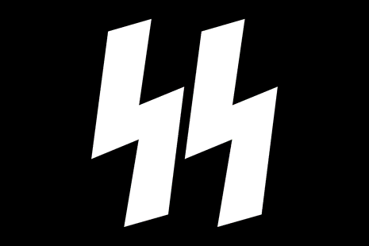

<!--StartFragment-->

The rapid modernization of technology has translated into the Internet becoming a medium for progressive discourse. When it comes to sexuality and identity, the Internet and social media platforms can provide a safe space for users to surround themselves virtually with like-minded people. However, not all spaces on the Internet can be so utopian, as proven by the abundance of minority marginalization. There has been a rise in a debate on a “new” sexuality: Super Straight.

The term Super Straight markets itself to be a new sexual orientation, used to describe people who claim that they are “so straight” that they are not attracted to transgender people. It was first utilized by Tik Tok creator Kyle Roce, a 20-year old from Canada, who stated in a video that a trans woman is “not a real woman to \[him].” Roce continued stating how he cannot be further objected to criticism for being transphobic because that was just his “sexuality.” His argument relies primarily on the notion that one’s sexuality cannot be dictated by others, and some supporters of Roce have noted that it was more legitimate than the other newer sexualities. Trans Youtuber Blaire White stated how the criticism Roce is facing is “hypocritical” coming from “folks who created abrosexual, demisexual, gerontosexual,” and more. She claimed how “even though Super Straight is a joke, the irony is that it’s a lot more valid than those \[she] just listed.”

The problem of the situation can be described by the same sentiment: that it is a joke. Because the majority is treating the issue as a mere joke, the transphobia and transphobic discourse that this term brings is not being properly addressed. Twitter users have provided evidence that the hashtag Super Straight has been utilized to fuel transphobic content on platforms such as 4chan by the alt-right. On the 4chan forum, one that has been consistently used by Neo-Nazis, there was even a mock pride flag created by users featuring the logo of the Schutzstaffel (SS), the Nazi special police, with a black and orange color scheme.

What is interesting to observe is the disparity between transgender discourse in American compared to South Korea. Indeed, South Korea’s social conservatism has allowed for the country to not have to directly address trans issues for the majority of the time, as they consider the subject to be taboo. In the media, there is minimal trans representation, with the most buzz being the recent death of South Korea’s first trans military soldier. Byun Hee Soo was discharged from the military for undergoing gender reassignment surgery and had launched a legal campaign against the military in last January. Her appeals for reinstatement was rejected in July, and her situation sparked much debate on the treatment of transgender troops. However, the discourse of her identity as well as the news of her death seemed to be more popular and promoted amongst the international audience than South Koreans. This highlights the stark difference between transgender issues in American and South Korea, where one side has an overabundance of discussion leading to bad faith discourse while the other simply lacks any form of conversation.

Truly, the issues regarding the transgender community and their rights are complex and cannot be summed up in a single short article. However, the recent trend of the Super Straight discourse clearly depicted how prevalent trans-rights discussion has become on the Internet. Regarding how the majority of users on social media sites such as Tik Tok, where the movement originally gained traction, are teenagers and young adults, it is noticeable that the youth has begun to be outspoken about and participate in such issues. The same cannot be said for South Korea, where legal same-sex partnerships are not legally recognized and there lacks a solid transgender representative community. Discourse and combating the apathy regarding the subjects is the first step to solving any problem, and if South Koreans begin to discuss the issues faced by trans-people, then the topic would not remain so stigmatized. The anti-stigmatization of the transgender community would subsequently force more citizens to become interested and educated on the trans community and further push for the protection of trans-rights.

Pictured above: the SuperStraight flag, made to resemble the flag of the Schutzstaffel (pictured below).

<!--EndFragment-->